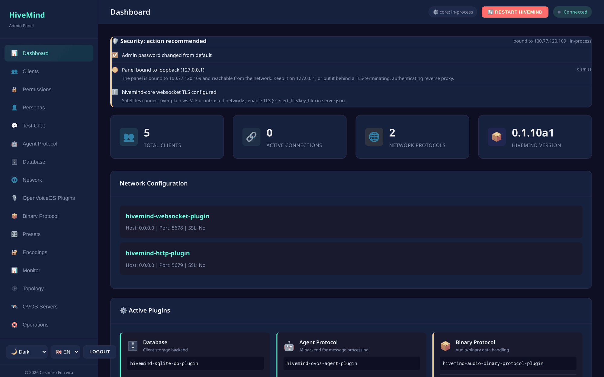

# HiveMind Admin Panel

Web-based administration panel for [HiveMind-core](https://github.com/JarbasHiveMind/HiveMind-core)
— a FastAPI backend and single-page web UI for running and managing a HiveMind hub.

It ships as a **standalone, optional package**. It's the single launcher: it starts
`hivemind-core` in-process and serves the admin UI, so you run **one** command and
get a hub plus a place to administer it.



## Features

- **Clients & access keys** — create, list, update, revoke; bulk ops; reveal
  credentials; **QR pairing** for one-tap satellite onboarding.
- **Per-client ACLs** — allow message types, skills, and intents; toggle
  escalate / propagate and admin flags; apply ACL templates.
- **Test Chat** — an in-browser chat that **impersonates any client**, talking
  through the hub to whatever agent is behind it. Exercises the real path: the
  client's ACL, routing, and the agent's reply.
- **Chat bridges** — provision a ready client for Matrix / Twitch / Mattermost /
  DeltaChat / HackChat bridges and see them labelled in the topology.
- **Security** — a forced first-run password change, a dashboard security
  self-check, session tokens, `admin`/`operator` roles, and an audit trail.
- **Monitor** — live metrics, an SSE event feed, the hub log tail, and the audit log.
- **Topology** — an interactive mesh graph (hub ↔ satellites) with online status.
- **Personas & agents** — manage personas (modern `handlers` schema), a **multi-turn
  memory-aware** test chat, **configurable + installable memory modules**, and
  pre-activation validation; browse the agent-engine taxonomy.
- **Plugin lifecycle** — install, **upgrade**, and **uninstall** plugins (with an
  active-module guard) and see installed versions.
- **Config safety** — `server.json` is snapshotted before every change; diff and
  one-click **revert** from the Operations page.
- **OVOS servers** — register and health-check external persona/STT/TTS/translate servers.
- **Plugins & databases** — discover/install network/agent/database & OVOS plugins
  (via uv); JSON / SQLite / Redis backends with profiles, tests, and migration.
- **Ops** — backup/restore, admission-policy editor, self-signed TLS certs.

## Install

```bash
pip install hivemind-admin-panel
```

## Quickstart

`hivemind-admin-panel` is the single launcher — it starts hivemind-core in-process
and serves the admin UI. You do **not** run `hivemind-core` separately.

```bash
hivemind-admin-panel --host 127.0.0.1 --port 8100
# open http://127.0.0.1:8100   (first login: admin / admin — you'll be forced to change it)
```

**Panel only** (manage on-disk config/database without starting a hub):

```bash
hivemind-admin-panel --no-core --host 127.0.0.1 --port 8100
```

**Docker Compose** (hivemind-core + admin panel + Redis):

```bash
docker compose up --build
# open http://127.0.0.1:8100  (edit docker/server.json to set admin_pass first)
```

> The hub bridges to an **agent backend** (an OVOS messagebus by default) for
> answers. Without one reachable, the panel stays up and tells you the satellite
> listener isn't ready — see [Troubleshooting](docs/troubleshooting.md).

## Screenshots

| Test Chat (impersonate a client) | Mesh topology |
|---|---|
| [](docs/img/test-chat.png) | [](docs/img/topology.png) |

| Forced first-run security | Provision a chat bridge |
|---|---|
| [](docs/img/first-run-gate.png) | [](docs/img/add-bridge.png) |

## Credentials

HTTP Basic / bearer auth, read from `~/.config/hivemind-core/server.json`
(`admin_user` / `admin_pass`, both default `admin`). On first login with the
default password the panel **forces** a change and stores it hashed (PBKDF2). It
can install packages and migrate databases — keep it on `127.0.0.1` or behind a
trusted reverse proxy. See [docs/security.md](docs/security.md).

## Documentation

Full docs in [`docs/`](docs/index.md) — a zero-to-hero path for newcomers and a
reference track for advanced devs.

**Newcomers:** [Concepts](docs/concepts.md) · [Getting started](docs/getting-started.md) ·
[Tutorial](docs/tutorial.md) · [Glossary](docs/glossary.md) ·
[Troubleshooting](docs/troubleshooting.md)

**Operate:** [Running](docs/running.md) · [CLI](docs/cli.md) ·
[Configuration](docs/configuration.md) · [Operations](docs/operations.md) ·
[Security](docs/security.md) · [Deployment](docs/deployment.md) ·
[OVOS servers](docs/ovos-servers.md) · [Chat bridges](docs/bridges.md) ·
[Test Chat](docs/test-chat.md)

**Develop:** [Architecture](docs/architecture.md) · [Extending](docs/extending.md) ·
[API reference](docs/api-reference.md) · [Development](docs/development.md) ·
[Roadmap](docs/roadmap.md)

## Relationship to HiveMind-core

The panel was extracted from core so it has its own release cadence and stays an
optional, separately-deployable admin plane. It is the launcher: it starts a
`hivemind-core` in-process and keeps a live reference to it, so core needs no
admin-specific code. See [docs/architecture.md](docs/architecture.md).

## License

Apache-2.0. See [LICENSE](LICENSE).
