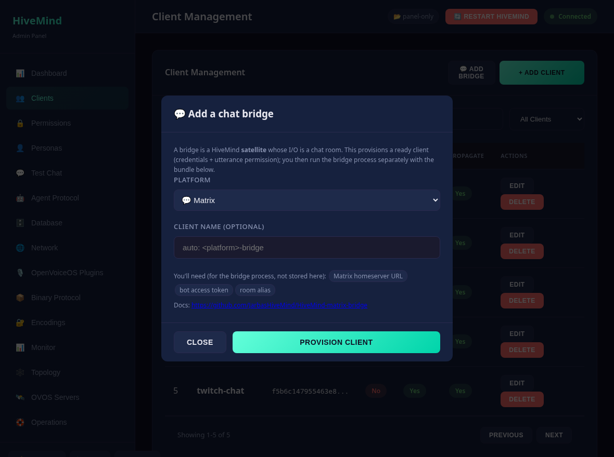
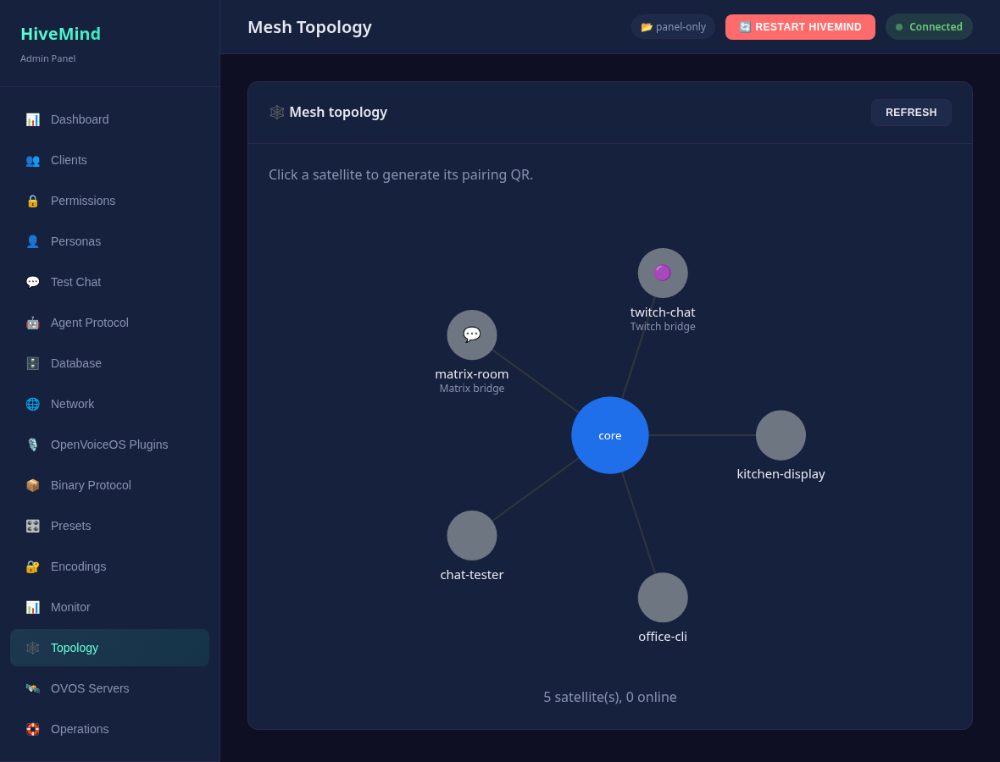

# Chat bridges

A **bridge** connects an external chat platform (Matrix, Twitch, Mattermost,
DeltaChat, or HackChat) to your hivemind-core. It is a HiveMind **satellite** whose
input and output are a chat room instead of a microphone. Messages in the room go
to the hub as `recognizer_loop:utterance`, and the hub posts its spoken reply
back to the room. This turns any HiveMind hub, and the OVOS skills or persona behind it, into a
chatbot on those platforms.

```
Chat room  ⇄  HiveMind-<platform>-bridge  ⇄  hivemind-core  ⇄  agent (OVOS / persona)
```

## What the panel does (and doesn't)

A bridge is just a **client** to the panel. The panel **provisions and watches**
bridges, but it does **not** run them. Each bridge is deployed as its own process, with
platform-specific dependencies and secrets (for example, a Matrix access token) that
stay out of the panel.

- **Provision**: *Clients → Add Bridge* creates a client with the right
  permission (`recognizer_loop:utterance`) and a `bridge:<platform>` tag, then
  shows the connection bundle (key, password, crypto key, host, port) to drop into
  the bridge's config.
- **Recognize**: provisioned bridges, and bridges added through `hivemind-core
  add-client` that announce a bridge useragent, are labelled with their platform
  icon on the **Topology** page and show up in `/connections`.

## Provision a bridge (UI)



1. Open **Clients → Add Bridge**.
2. Pick the platform. Optionally, name the client.
3. Enter the core address the bridge should reach (LAN IP if core binds `0.0.0.0`).
4. Copy the bundle (credentials and the `pip install` line) into the bridge's setup.

## Provision a bridge (API)

```bash
curl -u admin:PASS -X POST http://127.0.0.1:8100/api/bridges/provision \
  -H 'Content-Type: application/json' \
  -d '{"type": "matrix", "name": "matrix-bridge", "host": "192.168.1.10"}'
```

Returns `client_id`, the `bridge` catalog entry, and a `bundle` (the same payload
as `GET /clients/{id}/pairing`). `GET /api/bridges/catalog` lists the supported
platforms and what each one needs.

## Run the bridge

Install and start the bridge itself separately, pointing it at the bundle. Each
repo's README has the exact command and the platform credentials it needs:

| Platform | Repo |
|----------|------|
| Matrix | <https://github.com/JarbasHiveMind/HiveMind-matrix-bridge> |
| Twitch | <https://github.com/JarbasHiveMind/HiveMind-twitch-bridge> |
| Mattermost | <https://github.com/JarbasHiveMind/HiveMind_mattermost_bridge> |
| DeltaChat | <https://github.com/JarbasHiveMind/HiveMind-deltachat-bridge> |
| HackChat | <https://github.com/JarbasHiveMind/HiveMind-HackChatBridge> |

Once it connects, it appears on the **Topology** page with its platform icon, and
you can revoke it like any other client (which immediately drops it).



## Tips

- Pair it with a **persona** ([Personas](configuration.md)) or an
  [OVOS server](ovos-servers.md) so the bridge has something to answer with.
- Give bridges a recognizable client name. The `bridge:<platform>` tag is what
  the panel uses to label them, so keep it if you edit tags.

---
[← OVOS servers](ovos-servers.md) · [Home](index.md) · [Test Chat →](test-chat.md)
