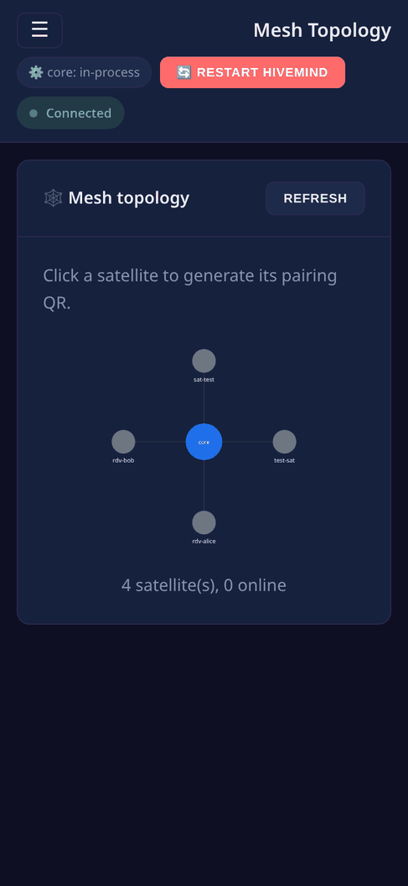

# Concepts — what is all this?

This page assumes **zero** prior knowledge. If you have never heard of HiveMind or
OVOS, read this first. Everything else in the docs builds on it.

## The big picture

**HiveMind** lets many voice devices share one "brain." Instead of every smart
speaker running its own heavy speech-and-AI stack, they connect over an encrypted
network to a central server that does the thinking and talks back.

```
   kitchen speaker ┐
   bedroom mic     ┼──(encrypted)──►  hivemind-core  ──►  an AI agent / OVOS
   office laptop   ┘                 (the server)         (answers questions)
```

- **hivemind-core**: the central server. It accepts connections, checks who is
  allowed to do what, and routes messages to the AI that answers. *This panel
  manages exactly one hivemind-core.*
- **Satellites**: the devices that connect to it (a voice satellite, a mic, a
  CLI). Each is a **client** with its own credentials.
- **The admin panel** (this project): a web UI to run all of the above without
  touching config files or the command line.

The panel visualizes this as a mesh, with the hub in the center and satellites (and
[chat bridges](bridges.md)) around it:


> You normally run **one command**, `hivemind-admin-panel`, which starts
> hivemind-core *and* the web UI together. See [Running](running.md).

## Clients & keys

Every satellite is a **client** in a database. A client has:

- an **access key** (`api_key`), like a username or token the device presents to
  connect
- a **password** and an optional **crypto key**: extra secrets for the encrypted
  handshake

You create clients in the panel and hand the credentials to the device, easiest
through a **QR code** (see the [Tutorial](tutorial.md)). The credentials store
never discards a client. "Deleting" a client actually **revokes** it.

## ACLs: who can do what

By default a satellite cannot do much. An **ACL** (Access Control List) is the set
of permissions for one client:

- **allowed message types**: HiveMind is **whitelist-only**. A client can only
  send the message types you explicitly allow (for example `recognizer_loop:utterance`
  to speak a request). Nothing else gets through.
- **skill and intent blacklists**: block specific skills or intents for that client.
- **flags**: `is_admin`, `can_escalate`, `can_propagate`, and `can_broadcast` control
  whether a client can act as an admin or relay messages to other nodes.

You can save common permission sets as **templates** and apply them in one click.

## Agents & personas — the actual "brain"

When a satellite sends an utterance, hivemind-core hands it to an **agent
protocol**, the thing that produces an answer. Common choices:

- **OVOS**: a full open-source voice assistant (skills, intents, TTS). This is
  [OpenVoiceOS](https://openvoiceos.org). HiveMind is built on it.
- **A persona**: an AI personality you define. A **persona** is a small JSON
  file with an ordered list of **handlers** (response engines): an LLM
  (OpenAI, Claude, Gemini, or a local model), a factual tool (Wikipedia, Wolfram Alpha),
  or a scripted bot. The persona tries each handler until one answers.

Modern OVOS calls these handlers **agent engines** (the older word "solver" is
deprecated). You can build a capable persona with **no GPU** using
search/scripted handlers, and mix in an LLM only if you want one. See
[Configuration → Personas](configuration.md#personas).

## OVOS, the message bus, and messages

OVOS components talk to each other over a **message bus** by passing **messages**,
each with a **message type** (`recognizer_loop:utterance` = "the user said
something", `speak` = "say this out loud", etc.). HiveMind extends that bus across
the network, and the ACL whitelist controls which message types each satellite may
use. The **message inspector** in the panel lets you watch these flow live.

## Transports, encodings & encryption

- **Network protocol (transport)**: *how* satellites connect. **Websocket**
  is the default (port 5678); HTTP and MQTT are also available.
- **Encoding**: *how* a message is serialized on the wire (for example `JSON-B64`).
- **Cipher**: the encryption used (for example `CHACHA20-POLY1305`). The mesh is
  encrypted end-to-end.

You rarely change these, but the panel exposes them on the **Encodings** page.

## Where things are stored

- **`~/.config/hivemind-core/server.json`**: all configuration and the admin
  credentials.
- **The client database**: JSON, SQLite, or Redis (your choice). The panel can
  switch backends and migrate clients between them.
- **Personas**: `~/.config/ovos_persona/*.json`.

## Ready?

You now know the vocabulary. Next:

- **[Getting started](getting-started.md)** — install and launch.
- **[Tutorial](tutorial.md)** — do it all end-to-end.
- **[Glossary](glossary.md)** — any term, defined.


### What it looks like

**Widescreen**


**Mobile**



---
[Home](index.md) · [Getting started →](getting-started.md)
