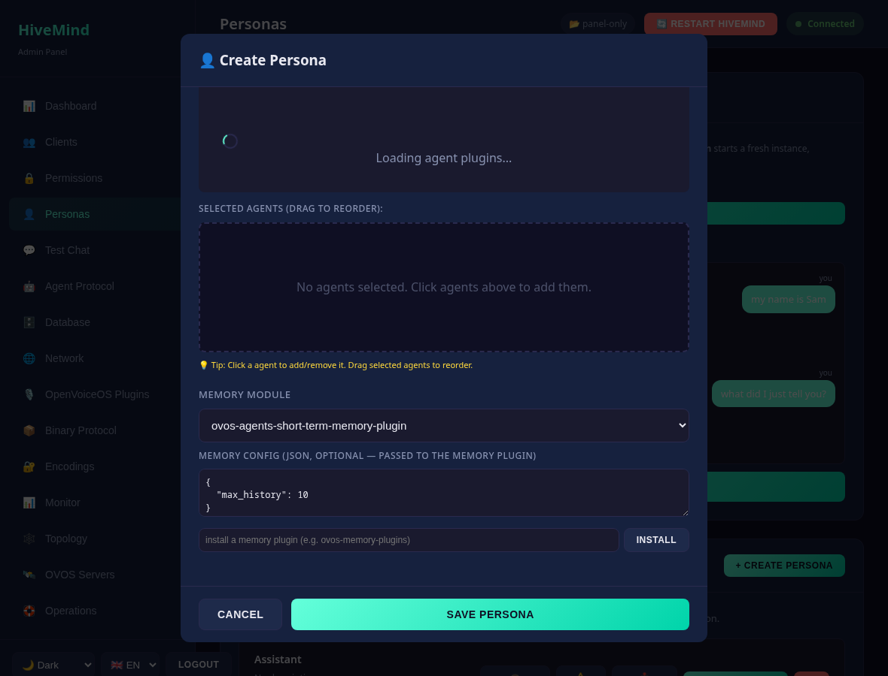
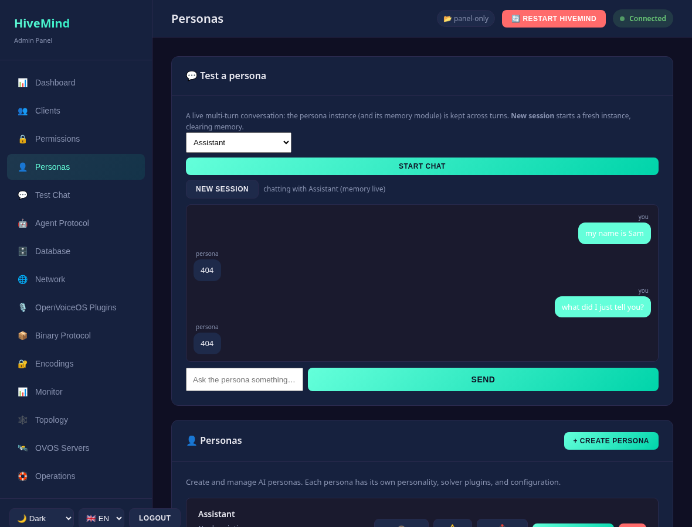

# Configuration

The panel does not have its own config file — it reads and writes the **same
`server.json` that `hivemind-core` uses**, at `~/.config/hivemind-core/server.json`
(XDG; honours `XDG_CONFIG_HOME`).

## Admin credentials

HTTP Basic auth is verified against two keys:

| Key | Default | Purpose |
|-----|---------|---------|
| `admin_user` | `admin` | admin panel username |
| `admin_pass` | `admin` | admin panel password |

```jsonc
{
  "admin_user": "admin",
  "admin_pass": "a-strong-password"
}
```

Comparisons are timing-safe (`hmac.compare_digest`). **Change the defaults before
binding the panel to anything other than `127.0.0.1`.**

## Database backend

The panel manages whatever client-database backend core is configured to use. The
backend is selected by `database.module` plus a backend-specific config block:

```jsonc
{
  "database": {
    "module": "hivemind-sqlite-database",
    "hivemind-sqlite-database": { "name": "clients", "subfolder": "hivemind-core" }
  }
}
```

Supported backends (install the matching package):

| Module | Package | Notes |
|--------|---------|-------|
| `hivemind-sqlite-database` | `hivemind-sqlite-database` | default; transactional, stdlib |
| `hivemind-json-db-plugin` | `hivemind-json-db-plugin` | simple file-based JSON store |
| `hivemind-redis-database` | `hivemind-redis-database` | networked; used by the Docker stack |

You can switch backends and migrate clients between them from the UI or the
`/database/profiles/*` and `/database/migrate` endpoints — see the
[API reference](api-reference.md). Database **profiles** are stored separately under
`~/.config/hivemind-core/database_profiles/*.json`.

## Other config

`GET /config` returns the full `server.json`; `POST /config` writes it back;
`GET /config/defaults` returns core's built-in defaults. The same file also holds
network/agent/binary protocol selection and the policy chain — the panel exposes
these for editing but they are core concepts; see core's documentation for their
semantics.

## Personas

Persona files live under `~/.config/ovos_persona/*.json` and are managed via the
`/personas/*` endpoints. The active persona is recorded in the agent-protocol block
of `server.json`.

A persona is a small JSON document with two modern keys:

```jsonc
{
  "name": "My Assistant",
  "handlers": ["ovos-solver-openai-plugin"],           // ordered response engines
  "ovos-solver-openai-plugin": { "api_url": "...", "key": "..." },
  "memory_module": "ovos-agents-short-term-memory-plugin"
}
```

- **`handlers`** — an ordered list of response-engine plugins (the persona tries each
  in turn). This is the current OVOS schema. The older key **`solvers`** is still
  accepted on input and read by `ovos-persona`, but the panel always **stores
  `handlers`**. Solver *plugins* (`ovos_plugin_manager.solvers` /
  `templates.solvers`) are deprecated in favour of the agent stack
  (`AbstractAgentEngine` in `ovos_plugin_manager.templates.agents`); the panel
  discovers handlers via the modern `ovos_plugin_manager.agents` chat engines, with a
  guarded fallback to legacy solvers for back-compat.
- **`memory_module`** — the conversational-memory plugin (default
  `ovos-agents-short-term-memory-plugin`). Installed options are listed by
  `GET /plugins/memory`; you can **install one from the persona editor**.
- **memory config** — like handlers, the memory module reads its config from a
  block keyed by its own entry point (`ovos-persona` does
  `config.get(memory_module)`). The persona editor exposes a **Memory config
  (JSON)** field for it:

  ```jsonc
  {
    "memory_module": "ovos-agents-short-term-memory-plugin",
    "ovos-agents-short-term-memory-plugin": { "max_history": 10 }
  }
  ```



Handlers can be LLM engines (OpenAI/Claude/Gemini/local GGUF), factual/tool engines
(Wolfram Alpha, Wikipedia, DuckDuckGo), or scripted ones (RiveScript) — mix freely; a
persona built only from factual/scripted handlers needs no GPU.

### Test a persona across turns

The Personas page has a **multi-turn** test chat: it keeps one live `Persona`
instance (and its memory module) across turns, so you can watch context and memory
accumulate — **New session** starts a fresh instance, clearing memory. It needs no
device or hub (the persona runs in-process). See [Test Chat](test-chat.md) for the
client-impersonation variant that goes through the hub.



The same persona JSON can be hosted over an OpenAI/Ollama HTTP API by
**ovos-persona-server** — see [OVOS servers & homelab synergy](ovos-servers.md).

---

<!-- nav-footer -->
|  |  |  |
|:--|:-:|--:|
| ← [CLI](cli.md) | [📖 Docs home](index.md) | [Operations](operations.md) → |
