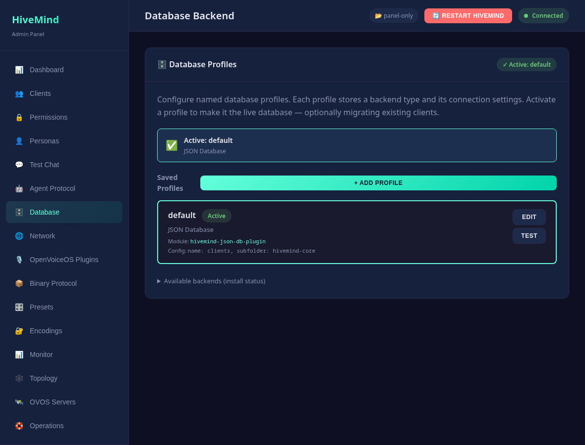
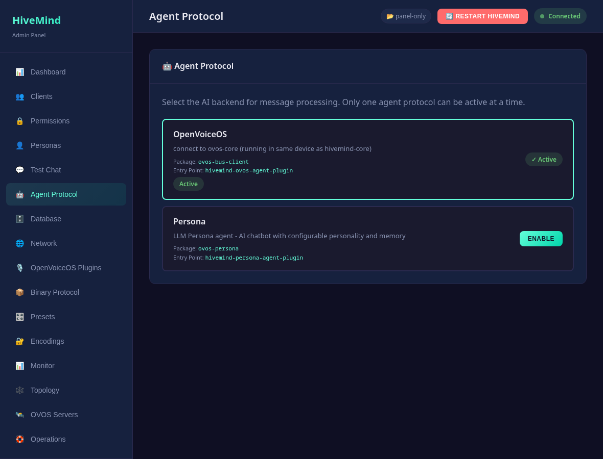
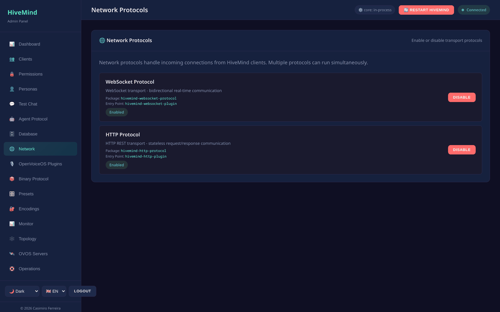
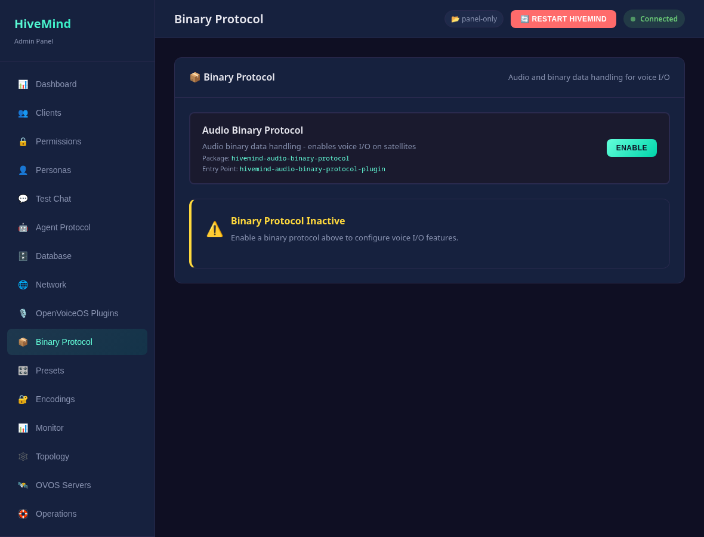
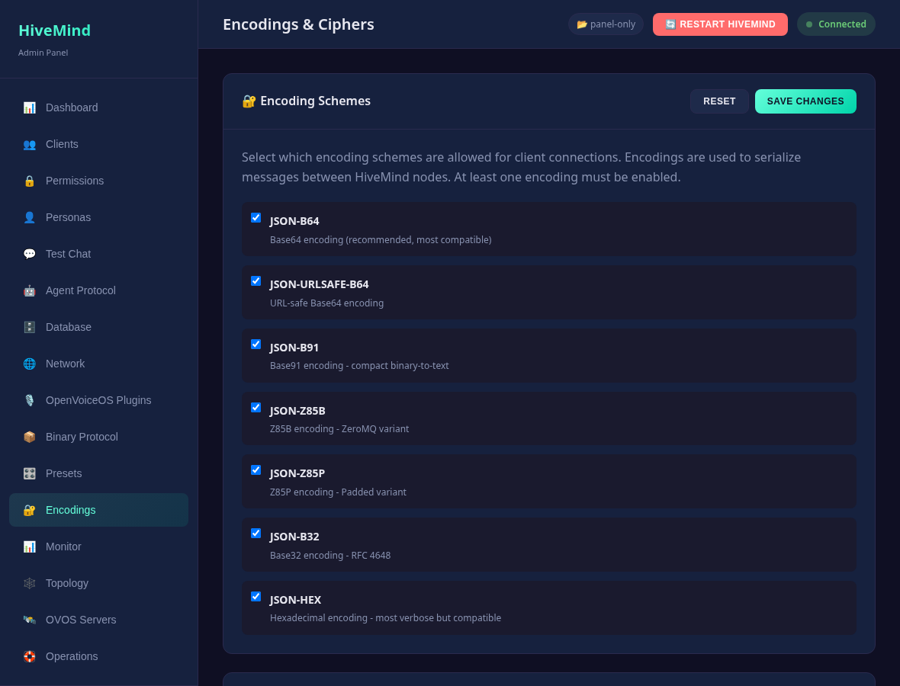

# Configuration

> **Paths in this file** omit the `/api` prefix the panel mounts the API under.
> A route written `/clients` is served at `http://<host>:8100/api/clients`.

The panel does not have its own config file. It reads and writes the **same
`server.json` that `hivemind-core` uses**, at `~/.config/hivemind-core/server.json`
(XDG; honors `XDG_CONFIG_HOME`).

## Admin credentials

HTTP Basic auth is verified against two keys:

| Key | Default | Purpose |
|-----|---------|---------|
| `admin_user` | `admin` | admin panel username |
| `admin_pass` | `admin` | admin panel password |

```jsonc
{
  "admin_user": "admin",
  "admin_pass": "a-strong-password"
}
```

Comparisons are timing-safe (`hmac.compare_digest`). **Change the defaults before
binding the panel to anything other than `127.0.0.1`.**

## Database backend

The panel manages whatever client-database backend core is configured to use. The
backend is selected by `database.module` plus a backend-specific config block:

```jsonc
{
  "database": {
    "module": "hivemind-sqlite-database",
    "hivemind-sqlite-database": { "name": "clients", "subfolder": "hivemind-core" }
  }
}
```

Supported backends (install the matching package):

| Module | Package | Notes |
|--------|---------|-------|
| `hivemind-sqlite-database` | `hivemind-sqlite-database` | default, transactional, stdlib |
| `hivemind-json-db-plugin` | `hivemind-json-db-plugin` | simple file-based JSON store |
| `hivemind-redis-database` | `hivemind-redis-database` | networked, used by the Docker stack |

You can switch backends and migrate clients between them from the UI or the
`/database/profiles/*` and `/database/migrate` endpoints. See the
[API reference](api-reference.md). Database **profiles** are stored separately under
`~/.config/hivemind-core/database_profiles/*.json`.



## Plugin slots

`server.json` selects the plugin for each slot, and the panel has a page per slot.
[Plugin presets](presets.md) make these configs reusable.

### Agent backend (Agent Protocol)

How the hub answers: an OVOS messagebus bridge, a [persona](#personas), or an A2A agent.



### Network protocols

The transports satellites connect over: websocket by default, plus HTTP and MQTT.



### Binary protocol (remote audio)

Optional: composes STT/TTS/wake-word/VAD so satellites can stream audio. Author the
speech configs as [presets](presets.md) and select them here.



### Encodings & ciphers

Which serialization encodings and ciphers clients may use. At least one of each must
stay enabled.



## Other config

`GET /config` returns the full `server.json`. `POST /config` writes it back.
`GET /config/defaults` returns core's built-in defaults. The policy chain and other
core concepts are editable here too (see core's docs for their semantics).

## Personas

Persona files live under `~/.config/ovos_persona/*.json` and are managed via the
`/personas/*` endpoints. The active persona is recorded in the agent-protocol block
of `server.json`.

A persona is a small JSON document with two modern keys:

```jsonc
{
  "name": "My Assistant",
  "handlers": ["ovos-solver-openai-plugin"],           // ordered response engines
  "ovos-solver-openai-plugin": { "api_url": "...", "key": "..." },
  "memory_module": "ovos-agents-short-term-memory-plugin"
}
```

- **`handlers`**: an ordered list of response-engine plugins (the persona tries each
  in turn). This is the current OVOS schema. The older key **`solvers`** is still
  accepted on input and read by `ovos-persona`, but the panel always **stores
  `handlers`**. Solver *plugins* (`ovos_plugin_manager.solvers` and
  `templates.solvers`) are deprecated in favor of the agent stack
  (`AbstractAgentEngine` in `ovos_plugin_manager.templates.agents`). The panel
  discovers handlers through the modern `ovos_plugin_manager.agents` chat engines, with a
  guarded fallback to legacy solvers for back-compat.
- **`memory_module`**: the conversational-memory plugin (default
  `ovos-agents-short-term-memory-plugin`). `GET /plugins/memory` lists installed
  options, and you can **install one from the persona editor**.
- **memory config**: like handlers, the memory module reads its config from a
  block keyed by its own entry point (`ovos-persona` does
  `config.get(memory_module)`). The persona editor exposes a **Memory config
  (JSON)** field for it.

  ```jsonc
  {
    "memory_module": "ovos-agents-short-term-memory-plugin",
    "ovos-agents-short-term-memory-plugin": { "max_history": 10 }
  }
  ```


Handlers can be LLM engines (OpenAI, Claude, Gemini, or a local GGUF model), factual or tool engines
(Wolfram Alpha, Wikipedia, DuckDuckGo), or scripted ones (RiveScript). You can mix them freely. A
persona built only from factual or scripted handlers needs no GPU.

### Test a persona across turns

The Personas page has a **multi-turn** test chat. It keeps one live `Persona`
instance (and its memory module) across turns, so you can watch context and memory
accumulate. **New session** starts a fresh instance, clearing memory. It needs no
device or hub, since the persona runs in-process. See [Test Chat](test-chat.md) for the
client-impersonation variant that goes through the hub.


The same persona JSON can be hosted over an OpenAI or Ollama HTTP API by
**ovos-persona-server**. See [OVOS servers](ovos-servers.md).

---
[← CLI](cli.md) · [Home](index.md) · [Plugin presets →](presets.md)
