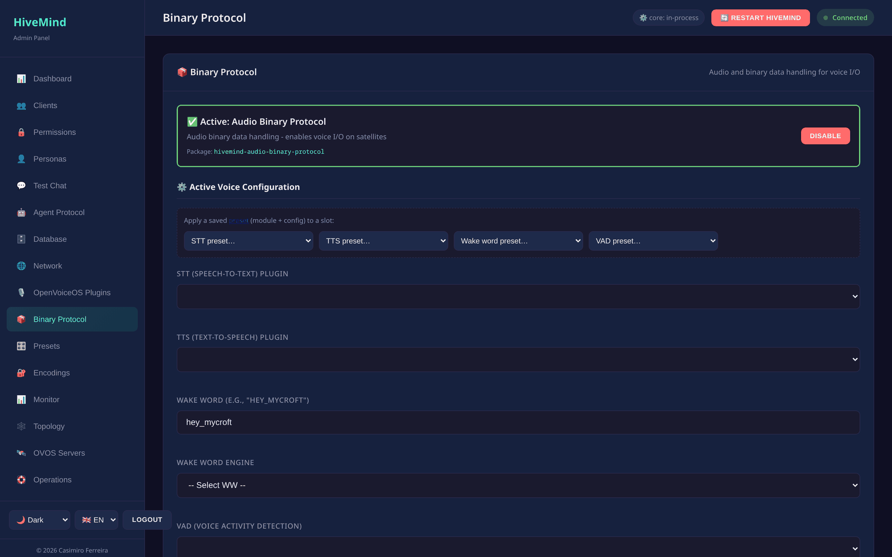
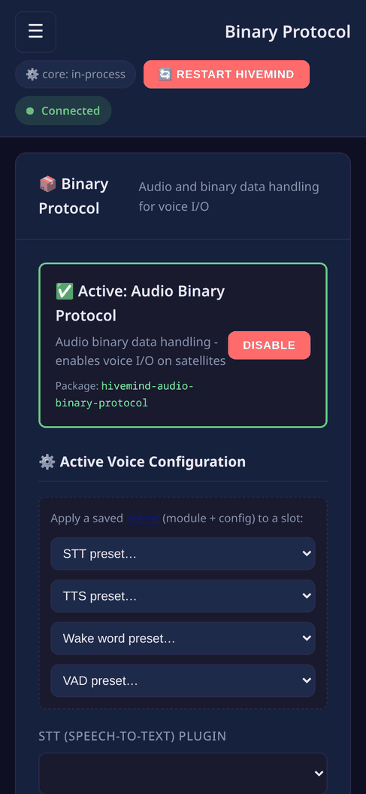
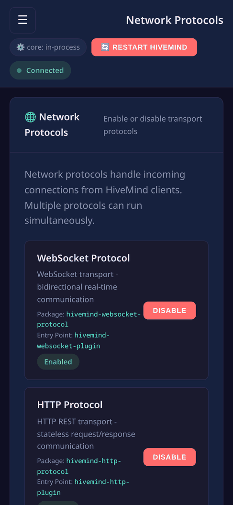

# Deployment

## Docker (single container)

The image runs `hivemind-admin-panel`, which starts hivemind-core in-process, so one
container serves hivemind-core (websocket transport) and the admin panel.

```bash
docker build -t hivemind-admin-panel .
docker run --rm \
  -p 5678:5678 -p 8100:8100 \
  -v hivemind-config:/home/hivemind/.config/hivemind-core \
  hivemind-admin-panel
```

Open [http://127.0.0.1:8100](http://127.0.0.1:8100). CI publishes the image to GHCR:

```bash
docker pull ghcr.io/jarbashivemind/hivemind-admin-panel:latest
```

Exposed ports: `5678` (websocket transport), `5679` (http transport), `8100`
(admin panel).

## Docker Compose (full stack)

The bundled `docker-compose.yml` brings up hivemind-core + admin panel backed by Valkey:

```bash
docker compose up --build
```

It defines two services:

- **redis**: the client-database backend, a Valkey container (persisted to a named volume).
- **hivemind**: hivemind-core and the admin panel, configured by `docker/server.json` (which
  selects the Redis backend and the admin credentials).

Edit `docker/server.json` and change `admin_pass` **before the first `up`**. The
value in the repository is a placeholder and is public, so it protects nothing.
The file is mounted read-only, so `POST /api/auth/password` cannot rewrite it —
in this configuration the password is changed by editing the file and restarting
the container.

The panel's own default-credentials gate does **not** catch this: it recognises
the shipped `admin`/`admin` only, and the compose placeholder is a different
string. Nothing will warn you.

The panel is published on `127.0.0.1:8100` only. Reach it through an SSH tunnel
or put a TLS proxy in front of it. The websocket transport is published on
`:5678` on all interfaces, because satellites must reach it.

Volumes:

| Volume | Holds |
|--------|-------|
| `redis-data` | the Valkey client database |
| `hivemind-config` | identity keys + `server.json` |
| `hivemind-data` | hivemind-core runtime state |

### Back up `redis-data` before you upgrade Valkey

The compose file uses `valkey/valkey:9-alpine`. The upgrade to Valkey 9 is
one way for the data volume. Valkey 7 and 8 write dump files in RDB version
11. Valkey 9 writes RDB version 80, and Valkey 7 cannot read that file.

The `redis` service starts with `--save 60 1`. Valkey 9 thus rewrites
`/data/dump.rdb` in the new format no more than one minute after a change to
the client database. After that rewrite, Valkey 7 refuses the
`redis-data` volume, and a rollback loses every client.

Copy the volume before the first `up` with the 9-alpine image.

Compose prefixes the volume with the project name, so the volume is not
called `redis-data` on disk. Read the real name and keep it in a variable
rather than typing one: `docker run -v <name>` **creates** a volume that does
not exist instead of failing, so a name that is close but wrong gives a
backup of an empty directory and says nothing is wrong.

```bash
VOL=$(docker volume ls --format '{{.Name}}' | grep -E '(^|_)redis-data$')
echo "$VOL"      # one line, e.g. hivemind-admin-panel_redis-data
```

If that prints nothing, the stack has never run and there is no data to back
up. If it prints more than one line, another compose project on this host has
a volume with the same suffix; pick the one whose prefix matches the `name:`
in `docker-compose.yml` and set `VOL` to it by hand.

```bash
docker compose stop redis
docker run --rm -v "$VOL":/data -v "$PWD":/backup alpine \
  tar czf /backup/redis-data.tar.gz -C /data .
tar tzf redis-data.tar.gz | head     # dump.rdb should be in the list
```

The last line is the check that the archive holds the database rather than an
empty directory.

To go back to Valkey 7, put the image back to `valkey/valkey:7-alpine`,
remove the volume Valkey 9 wrote, and restore the copy into a new volume with
the same name:

```bash
docker compose down
docker volume rm "$VOL"
docker volume create "$VOL"
docker run --rm -v "$VOL":/data -v "$PWD":/backup alpine \
  tar xzf /backup/redis-data.tar.gz -C /data
docker compose up -d
```

The restore gives the state of the backup. The clients that you added after
the backup are not in it.

## Behind a reverse proxy (TLS)

Run the panel on `127.0.0.1` and terminate TLS + add access control at the proxy.
Example nginx:

```nginx
server {
    listen 443 ssl;
    server_name hivemind.example.org;
    # ssl_certificate / ssl_certificate_key ...

    location / {
        proxy_pass http://127.0.0.1:8100;
        proxy_set_header Host $host;
        proxy_set_header X-Forwarded-For $remote_addr;
        proxy_set_header X-Forwarded-Proto $scheme;
    }
}
```

The panel still enforces its own Basic auth. The proxy can add a second factor.

## systemd (standalone panel)

```ini
# /etc/systemd/system/hivemind-admin-panel.service
[Unit]
Description=HiveMind Admin Panel
After=network-online.target

[Service]
ExecStart=/usr/local/bin/hivemind-admin-panel --host 127.0.0.1 --port 8100
Restart=on-failure
User=hivemind

[Install]
WantedBy=multi-user.target
```

```bash
sudo systemctl enable --now hivemind-admin-panel
```

This single unit runs hivemind-core and the panel together. Add `--no-core` to the
`ExecStart` line if hivemind-core is managed by a separate service on the host.


### What it looks like

Audio streaming is configured in the binary protocol screen:





and the listeners a deployment exposes are here:

**Widescreen**


**Mobile**



---
[← Security](security.md) · [Home](index.md) · [OVOS servers →](ovos-servers.md)
