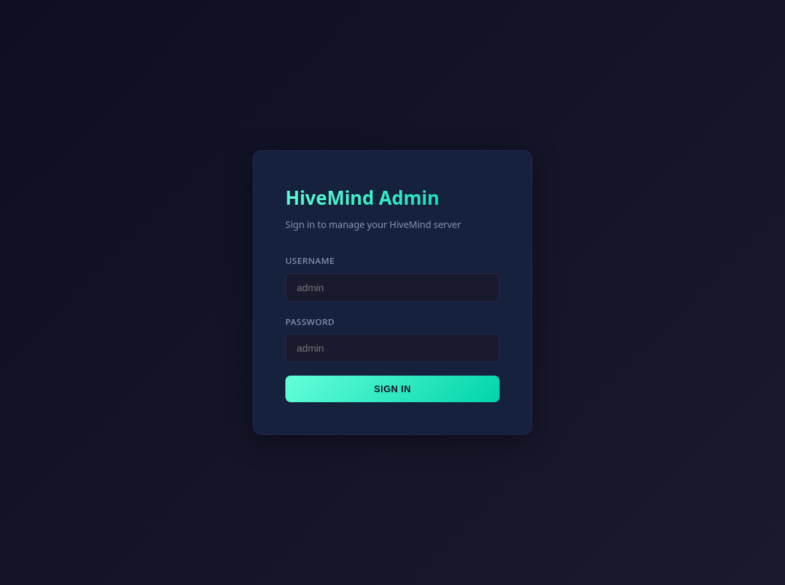

# Getting started

## Requirements

- Python 3.10+
- A [HiveMind-core](https://github.com/JarbasHiveMind/HiveMind-core) install (pulled
  in automatically as a dependency).

## Install

```bash
pip install hivemind-admin-panel
```

Installing the panel also installs `hivemind-core`.

## First run

```bash
hivemind-admin-panel --host 127.0.0.1 --port 8100
```

This launches a hivemind-core **in-process** and serves the admin panel. You do
not run `hivemind-core` separately. Open <http://127.0.0.1:8100>. You will be
prompted for HTTP Basic credentials.



## Set your credentials

The defaults are `admin` / `admin`. On your **first login with the default
password, the panel forces a change** (and stores it hashed) before you can use
anything, so the very first thing you see is:


You can also set credentials directly in `~/.config/hivemind-core/server.json`
(keys `admin_user` and `admin_pass`). See [Configuration](configuration.md) and
[Security](security.md).

```jsonc
{
  "admin_user": "admin",
  "admin_pass": "a-strong-password"
}
```

## Panel only (no in-process hivemind-core)

To manage on-disk state without starting a hivemind-core instance (or when a hivemind-core instance is managed
elsewhere on the host), use `--no-core`:

```bash
hivemind-admin-panel --no-core --host 127.0.0.1 --port 8100
```

See [Running](running.md) for the difference between the two modes.

## Next steps

- [Configuration](configuration.md): credentials and the database backend.
- [API reference](api-reference.md): drive everything over REST.
- [Deployment](deployment.md): Docker, Compose, or reverse proxy.

---
[← Concepts](concepts.md) · [Home](index.md) · [Tutorial →](tutorial.md)
