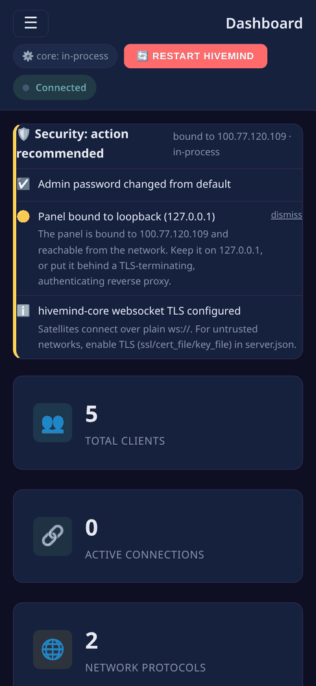

# HiveMind Admin Panel — Documentation

A web-based admin panel for [hivemind-core](https://github.com/JarbasHiveMind/HiveMind-core).
Manage the devices on your voice mesh, control who is allowed to do what, choose the AI that
answers, and watch it all live, from a browser.

New here? Read **[Concepts](concepts.md)** first, then follow the
**[Tutorial](tutorial.md)**. Already know HiveMind? Jump to the
**[CLI](cli.md)** or **[API reference](api-reference.md)**.

### What it looks like

**Widescreen**

**Mobile**

---

## Zero to running (newcomers)

Start here if you've never run HiveMind. No prior knowledge assumed.

1. **[Concepts](concepts.md)**: what hivemind-core, a satellite, an ACL, a
   persona, and an agent actually are, in plain language.
2. **[Getting started](getting-started.md)**: install and launch in two commands.
3. **[Tutorial: zero to hero](tutorial.md)**: a full walkthrough. Launch, pair
   your first satellite with a QR code, lock it down with an ACL, give it a
   personality, and watch messages flow live.
4. **[Glossary](glossary.md)**: every term, defined.
5. **[Troubleshooting & FAQ](troubleshooting.md)**: when something does not
   work. Covers the failures people actually hit — a reinstalled satellite that
   will not reconnect, two services fighting over port 5678, an upgrade that
   leaves the hub on an old version, and a crash loop after a plugin goes
   missing.

## Operate it (running a real deployment)

1. **[Running](running.md)**: in-process (default) vs. `--no-core`.
2. **[CLI reference](cli.md)**: every command-line flag.
3. **[Configuration](configuration.md)**: `server.json`, credentials, database
   backends, personas.
4. **[Plugin presets](presets.md)**: reusable STT/TTS/WW/VAD/agent/network configs.
5. **[Operations](operations.md)**: monitoring, sessions and roles, pairing,
   backup/restore, policy, TLS.
6. **[Security](security.md)**: the auth model and how to harden it.
7. **[Deployment](deployment.md)**: Docker, Compose, reverse proxy, systemd.
8. **[OVOS servers](ovos-servers.md)**: persona, STT, TTS, and translate servers and the
   homelab topology.
9. **[Chat bridges](bridges.md)**: bring Matrix, Twitch, Mattermost, DeltaChat, or HackChat
   rooms into your hub.
10. **[Test Chat](test-chat.md)**: chat through the hub as any client to verify it
    end-to-end.

## Hack on it (advanced developers)

1. **[Architecture](architecture.md)**: components, the injection seam, the live
   protocol tap, the threading model.
2. **[Extending the panel](extending.md)**: add an endpoint, a UI page, or a
   translation, using the module map.
3. **[API reference](api-reference.md)**: every REST endpoint with `curl`.
4. **[Development](development.md)**: local setup, the end-to-end test suite, CI.
5. **[Roadmap & status](roadmap.md)**: what is built.

---

## What it manages, at a glance

| Area | What you can do |
|------|-----------------|
| **Clients** | Provision satellites, mint or reveal keys, QR-pair, tag, bulk-edit |
| **ACLs** | Per-client whitelists of message types, skills, and intents; admin, escalate, and propagate flags |
| **Test Chat** | Impersonate any client and chat through the hub to verify it end-to-end |
| **Bridges** | Provision and recognize Matrix, Twitch, Mattermost, DeltaChat, and HackChat bridges |
| **Agents & personas** | Pick the AI that answers, author personas, and run a live test chat |
| **Monitoring** | Live metrics, event feed, message inspector, log tail, audit log |
| **Databases** | JSON, SQLite, or Redis backends, with profiles and migration |
| **Plugins** | Discover and install network, agent, database, and voice plugins (via uv) |
| **Ops** | Backup and restore, policy chain, TLS certs |
| **Servers** | Register and health-check external OVOS servers |

## Two ways to run it

- **Default**: `hivemind-admin-panel` starts hivemind-core *in-process* and
  serves the UI. You run **one** command. There is no separate `hivemind-core`
  process to manage.
- **`--no-core`**: serve the panel only, against a host's on-disk state or a
  hivemind-core managed elsewhere.

See [Running](running.md).

## License

Apache-2.0.
