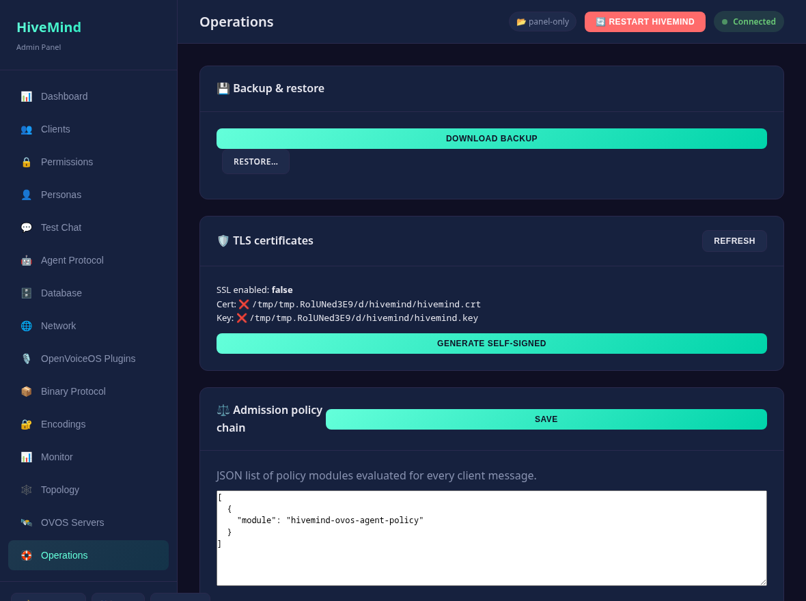

# Operations & monitoring

Beyond configuration, the panel is an operations console. This page covers the
real-time, security, onboarding and ops features.

## Monitor (real-time)


The **Monitor** page surfaces live state:

- **Metrics** — uptime, active connections, total clients, service status, and
  action counters (`GET /metrics`). Tick **live** to stream updates over
  Server-Sent Events (`GET /events`).
- **Event feed** — recent hivemind-core/admin events from an in-process ring buffer
  (`GET /events/recent`); the SSE stream pushes new ones as they happen.
- **hivemind-core log** — tail of `core.log` with optional level filter (`GET /logs`).
- **Audit log** — every mutating admin request, with the acting user
  (`GET /audit`).

> The SSE feed authenticates with a short-lived token passed as `?access_token=`
> because the browser `EventSource` API cannot set headers.

## Authentication, roles & audit

- **Session tokens** — `POST /auth/login` exchanges credentials for an
  HMAC-signed bearer token; send it as `Authorization: Bearer <token>`. HTTP
  Basic still works for scripts/back-compat. `GET /auth/me` reports the current
  user/role; `POST /auth/logout` is a client-side token discard.
- **Roles** — `admin` (full) and `operator` (read + non-destructive writes).
  Extra accounts go in `server.json`:

  ```jsonc
  { "users": [{ "username": "ops", "password": "...", "role": "operator" }] }
  ```

  Destructive actions (plugin install, DB migrate/clear, restore, policy/cert
  writes) require the `admin` role.
- **Audit log** — a middleware records every `POST`/`PUT`/`DELETE` (user, path,
  status) to `~/.local/share/hivemind-admin/audit.log`.
- **uv installs** — `POST /plugins/install` uses `uv` (pip fallback) and is
  admin-gated.

## Satellite onboarding (pairing)

The **Topology** page draws hivemind-core and its satellites; click a satellite to open
a **pairing modal** with a scannable **QR code** and the full bundle:

- `GET /clients/{id}/pairing` — credentials + hivemind-core websocket endpoint + a QR JSON
  payload. Pass `?host=<LAN-IP>` when hivemind-core binds `0.0.0.0`.
- `GET /clients/{id}/pairing/qr.svg` — the bundle rendered as a QR SVG.
- `POST /clients/bulk` — batch `delete` / `make_admin` / `revoke_admin` /
  `apply_template` over many clients.

## OVOS servers

The **OVOS Servers** page registers external [persona/STT/TTS/translate
servers](ovos-servers.md) and health-checks them:

- `GET/POST /servers`, `DELETE /servers/{id}` — registry stored under
  `~/.config/hivemind-admin/servers.json`.
- `GET /servers/{id}/health` — reachability + latency probe.

## Personas & agents

- `POST /personas/{name}/chat` powers the **Test a persona** widget — send a
  message, get a live reply.
- `GET /plugins/agents` lists installed plugins per modern engine type (chat,
  memory, summarizer, reranker, retrieval, QA, yes/no, multimodal, coreference).
- `GET /plugins/memory` lists persona memory plugins.

## Backup, policy & TLS (Operations page)



- **Backup/restore** — `GET /backup` downloads a config + clients + servers
  bundle; `POST /restore` re-adds missing clients (and optionally config/servers).
- **Policy chain** — `GET/PUT /policy` edits the message admission policy chain.
- **TLS certs** — `GET /certs` shows certificate status for the websocket
  transport; `POST /certs/generate` creates a self-signed cert.

## Mesh topology

`GET /topology` returns graph data (hivemind-core + client nodes, edges, live `online`
flags) — rendered as an interactive SVG on the Topology page.

## API docs

FastAPI's interactive Swagger UI is served at **`/api/docs`** (OpenAPI schema at
`/api/openapi.json`).

## Live monitoring & message inspector

When hivemind-core runs **in-process** (the default), the panel taps the listener
protocol, so `/connections`, `/stats`, the topology `online` flags, and the
**message inspector** (`GET /messages/recent`, filter by `msg_type`/`peer`) are
authoritative — no hivemind-core change required. In `--no-core` mode they degrade
gracefully.

## Security notes

- **Password hashing** — `server.json` passwords may be PBKDF2 hashes
  (`pbkdf2_sha256$…`); legacy plaintext still works. Change your password with
  `POST /auth/password` (stores a hash).
- **CSRF** is not applicable: the API authenticates via the `Authorization` header
  (Basic/Bearer), not cookies, so it is not exposed to cross-site request forgery.
- **Config dry-run** — `POST /config/diff` previews added/removed/changed keys
  before you apply a config.

---

<!-- nav-footer -->
|  |  |  |
|:--|:-:|--:|
| ← [Configuration](configuration.md) | [📖 Docs home](index.md) | [Security](security.md) → |
