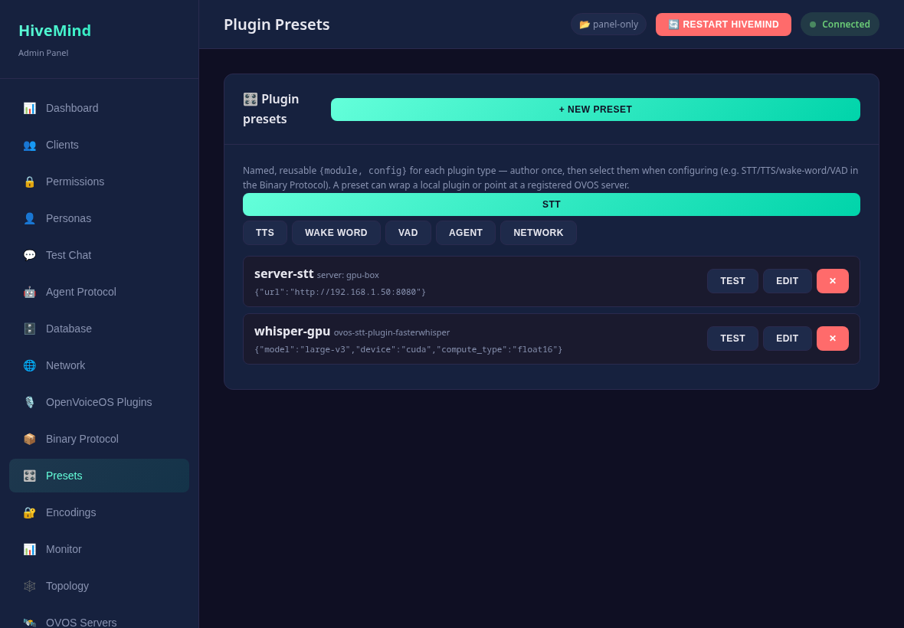

# Plugin presets

A **preset** is a named, reusable `{module, config}` for a plugin slot — the same
idea as the database backend profiles, generalized to every plugin type
(STT, TTS, wake word, VAD, agent, network). Author a config once (e.g. a
`whisper-gpu` STT or a `piper-en` TTS), test it, and reuse it instead of retyping
config every time you configure something.

## Why

STT/TTS/WW/VAD configs are the least trivial (model, device, compute type, voice,
language, thresholds) and the most reusable across a homelab. Presets give you a
small **library** of known-good configs to pick from, and each can be **tested**
(is the module installed?) before you rely on it.

## Two kinds of preset

- **Local plugin** — wraps an installed plugin entry point + its config.
- **OVOS server** — points at a [registered OVOS server](ovos-servers.md)
  (`ovos-stt-http-server`, `ovos-tts-server`, …) so "use the GPU box's STT" is one
  selection instead of a config block.

## Manage them

Open **🎛️ Presets**, pick a type tab, and **+ New preset**: choose the source
(local plugin or server), the module (from the installed list), and edit the config
as JSON. **Test** runs a lightweight load-check (module installed for its type — no
model download). Edit/Delete from each card.

## Use them

- **Agent / Network** presets have an **Apply** button that activates them in
  `server.json` (snapshotting the current config first, then prompting a restart).
- **STT / TTS / WW / VAD** presets are authored and tested here, then **selected
  when you configure the Binary Protocol** (which composes the speech stack for
  remote-audio satellites). Keeping them as a library means a config like
  `whisper-large-cuda-float16` is written and verified once.

## API

| Method | Path | Description |
|--------|------|-------------|
| GET    | `/presets` · `/presets/{type}` | All presets, or one type (+ `installed_modules`) |
| GET    | `/presets/{type}/{name}` | One preset |
| POST   | `/presets/{type}` | Create `{name, module, config, source?, server_id?}` (admin) |
| PUT    | `/presets/{type}/{name}` | Update (admin) |
| DELETE | `/presets/{type}/{name}` | Delete (admin) |
| POST   | `/presets/{type}/{name}/test` | Load-check (module installed) |
| POST   | `/presets/{type}/{name}/apply` | Activate agent/network preset into `server.json` (admin) |

Types: `stt` · `tts` · `ww` · `vad` · `agent` · `network`. Stored under
`~/.config/hivemind-core/plugin_presets/{type}/{name}.json`.

---

<!-- nav-footer -->
|  |  |  |
|:--|:-:|--:|
| ← [Configuration](configuration.md) | [📖 Docs home](index.md) | [Operations](operations.md) → |
