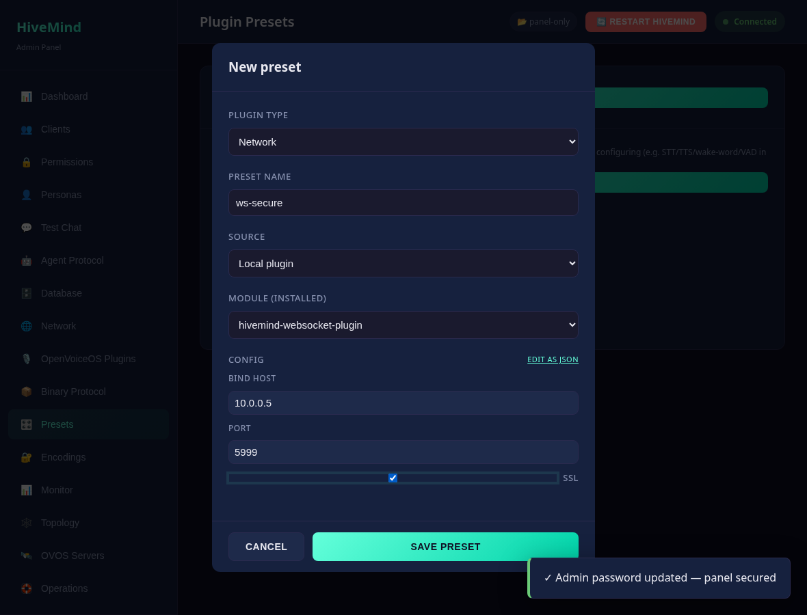
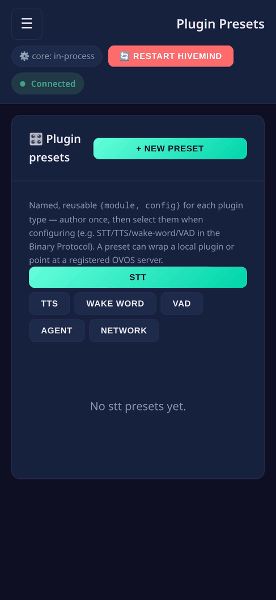

# Plugin presets

> **Paths in this file** omit the `/api` prefix the panel mounts the API under.
> A route written `/clients` is served at `http://<host>:8100/api/clients`.

A **preset** is a named, reusable `{module, config}` for a plugin slot, the same
idea as the database backend profiles, generalized to every plugin type
(STT, TTS, wake word, VAD, agent, network). Author a config once (for example a
`whisper-gpu` STT or a `phoonnx-en` TTS), test it, and reuse it instead of retyping
config every time you configure something.

## Why

STT/TTS/WW/VAD configs are the least trivial (model, device, compute type, voice,
language, thresholds) and the most reusable across a homelab. Presets give you a
small **library** of known-good configs to pick from, and each can be **tested**
(is the module installed?) before you rely on it.

## Two kinds of preset

- **Local plugin**: wraps an installed plugin entry point and its config.
- **OVOS server**: points at a [registered OVOS server](ovos-servers.md)
  (`ovos-stt-http-server`, `ovos-tts-server`, and others) so "use the GPU box's STT" is one
  selection instead of a config block.

## Manage them

Open **Presets**, pick a type tab, and **+ New preset**: choose the source
(local plugin or server) and the module (from the installed list). Known plugins
get a **schema-driven form** (typed fields like model, device, voice, port, and
ssl). Anything else falls back to a JSON editor, and you can flip between the two
with **edit as JSON**. **Test** runs a lightweight load-check (module installed for
its type, no model download). Edit or delete from each card.

## Use them

Every preset has an **Apply** button (snapshots `server.json` first, then prompts a
restart):

- **Agent / Network** presets apply into the matching top-level slot.
- **STT / TTS / WW / VAD** presets apply into the **active binary protocol's**
  config, so a config like `whisper-large-cuda-float16` is written and verified
  once, then dropped into the speech stack. You can also pick them from the
  **Binary Protocol** page's quick-fill row (one dropdown per slot). Enable a
  binary protocol first; applying a speech preset before that returns a clear error.

## API

| Method | Path | Description |
|--------|------|-------------|
| GET    | `/presets` · `/presets/{type}` | All presets, or one type (+ `installed_modules`) |
| GET    | `/presets/{type}/{name}` | One preset |
| POST   | `/presets/{type}` | Create `{name, module, config, source?, server_id?}` (admin) |
| PUT    | `/presets/{type}/{name}` | Update (admin) |
| DELETE | `/presets/{type}/{name}` | Delete (admin) |
| POST   | `/presets/{type}/{name}/test` | Load-check (module installed) |
| POST   | `/presets/{type}/{name}/apply` | Apply (admin): agent/network → top-level slot, stt/tts/ww/vad → active binary protocol |

Types: `stt` · `tts` · `ww` · `vad` · `agent` · `network`. Stored under
`~/.config/hivemind-core/plugin_presets/{type}/{name}.json`.

### What it looks like

**Widescreen**

<!-- duplicate screenshot removed -->

**Mobile**

---
[← Configuration](configuration.md) · [Home](index.md) · [Operations →](operations.md)
