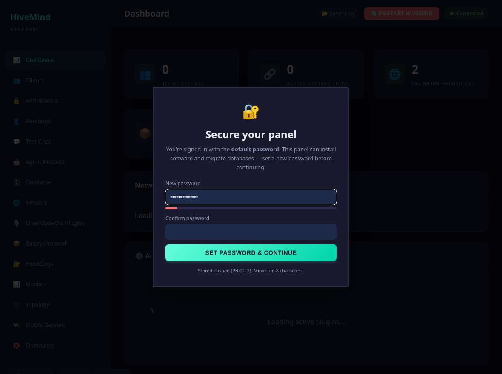
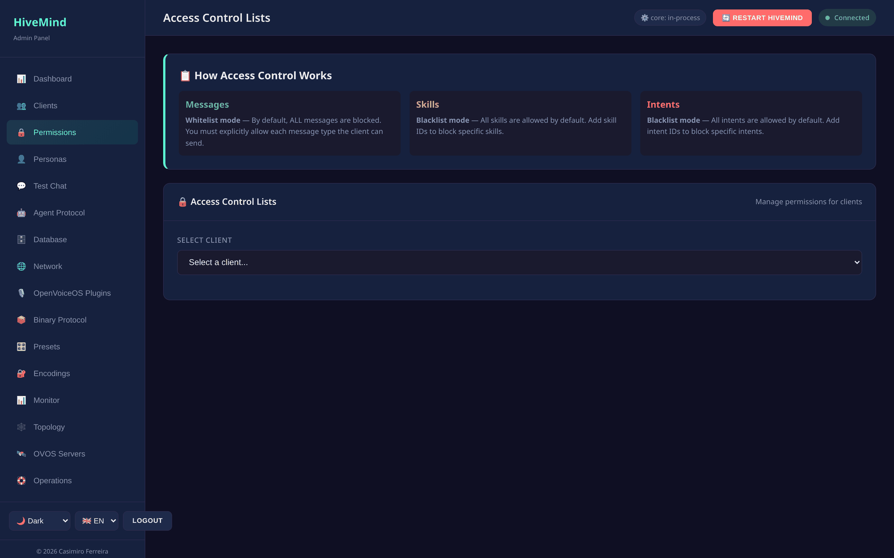
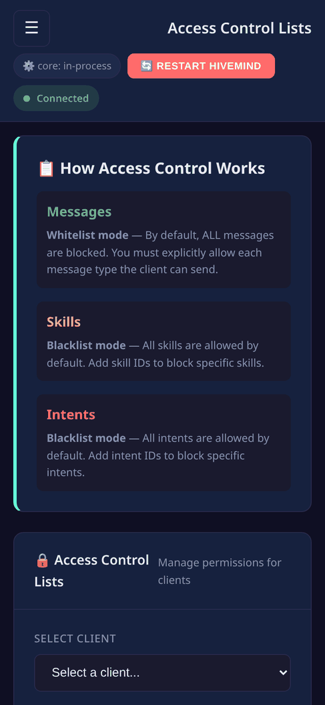

# Security

> **Paths in this file** omit the `/api` prefix the panel mounts the API under.
> A route written `/clients` is served at `http://<host>:8100/api/clients`.

The admin panel is a **privileged control plane**. Through it an authenticated
caller can install Python packages, migrate and clear databases, mint client
credentials, and restart the service. Treat access to it as equivalent to shell
access on the host.

## Authentication

- **HTTP Basic** (or a Bearer token from `POST /auth/login`) on every endpoint
  except `GET /health`. The web UI uses **only** bearer tokens; it never stores
  the plaintext password.
- Credentials come from `server.json` (`admin_user` / `admin_pass`). Comparison is
  timing-safe. New passwords are stored **hashed** (PBKDF2) through `POST /auth/password`.
- `POST /auth/password` re-keys the token signing secret, so a password change
  **revokes every token that was issued before it**.
- Failed logins are throttled: 10 failures for one username in 5 minutes give
  `429` until the window passes.
- The panel writes `server.json` with mode `0600`. It holds the admin password,
  the token signing secret and every satellite credential.
- The defaults are `admin` / `admin`.

## First-run gate & self-check

The panel actively pushes you off the defaults rather than just warning:

- **Forced password change, enforced by the server.** While the default password
  is in use, every route except `/health`, `/auth/login`, `/auth/logout`,
  `/auth/me`, `/auth/password` and `/setup/status` answers `403`. The blocking
  modal in the UI is only the visible half of the gate; `curl` gets the same
  answer.
- **The panel refuses to start on a non-loopback address with default
  credentials.** Change `admin_pass`, bind `127.0.0.1`, or pass
  `--i-know-what-im-doing` to accept the risk deliberately.
- **Dashboard security self-check.** A card at the top of the dashboard runs
  `GET /setup/status` and reports, with red/yellow/green status and a fix hint:
  whether the admin password is still default (critical), whether the panel is
  bound to a non-loopback address (warning), and whether the hivemind-core
  websocket has TLS configured (info). It stays red until criticals clear.
  A *warning* you have handled deliberately (for example binding `0.0.0.0` behind a proxy)
  can be **dismissed** from the card. Criticals cannot be dismissed, and the dismissal is
  audit-logged.
- **Run-mode badge.** The top bar shows whether hivemind-core runs **in-process**
  (closing the panel stops the server) or the panel is in **panel-only** mode.

## Network exposure

- Bind to `127.0.0.1` (the default in both modes) unless the panel sits behind a
  trusted reverse proxy that terminates TLS and adds authentication.
- `--host 0.0.0.0` (and the Docker image) expose it on all interfaces. Only
  do this behind a proxy or firewall. See [Deployment](deployment.md).
- The panel speaks plain HTTP. Put TLS at the proxy.

## Endpoints to watch

| Endpoint | Risk |
|----------|------|
| `POST /plugins/install` | runs `pip install <package>` in the server's interpreter |
| `POST /database/migrate`, `/database/{module}/clear` | move or delete client records |
| `POST /clients`, `/clients/{id}/credentials` | mint / reveal access keys and crypto keys |
| `POST /config`, `/config/restart` | rewrite `server.json`, restart hivemind-core |

## Roles

`admin` is full access. `operator` (extra accounts in the `users` list) gets read
access and non-destructive writes. Operators cannot create, edit, delete or
re-permission clients, cannot read client credentials, and cannot write the
config or switch the database profile.

## Cross-site request protection

State-changing requests (`POST`, `PUT`, `PATCH`, `DELETE`) are refused when:

- the `Content-Type` is one an HTML form can produce
  (`application/x-www-form-urlencoded`, `multipart/form-data`, `text/plain`) —
  answered `415`; or
- `Sec-Fetch-Site` says `cross-site`/`same-site`, or `Origin` does not match the
  request `Host` — answered `403`.

The panel also does not send `WWW-Authenticate: Basic` on a `401`, so browsers do
not cache and replay the credentials.

## Current hardening gaps

These are known and worth accounting for when deploying:

- Passwords in `server.json` are only hashed once `POST /auth/password` has
  written them. A hand-edited `admin_pass` stays plaintext on disk.
- Bearer tokens are stateless and live 12 hours. There is no per-token
  revocation; changing the password revokes all of them at once.
- `POST /plugins/install` installs into the live interpreter. The new package is not
  importable until the service restarts, and the endpoint trusts the caller to
  supply a sane package name. Restrict who can reach the panel accordingly.

## Recommended posture

1. Strong `admin_pass`.
2. Bind `127.0.0.1`, or `0.0.0.0` only behind a TLS-terminating, authenticating
   reverse proxy.
3. Network-isolate the host; the panel and the OVOS bus it can reach are trusted
   surfaces.

### What it looks like

**Widescreen**

**Mobile**

---
[← Operations](operations.md) · [Home](index.md) · [Deployment →](deployment.md)
