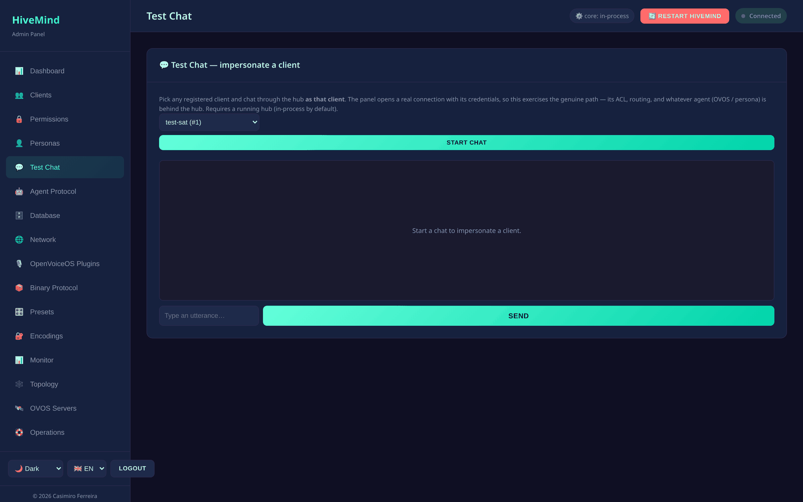
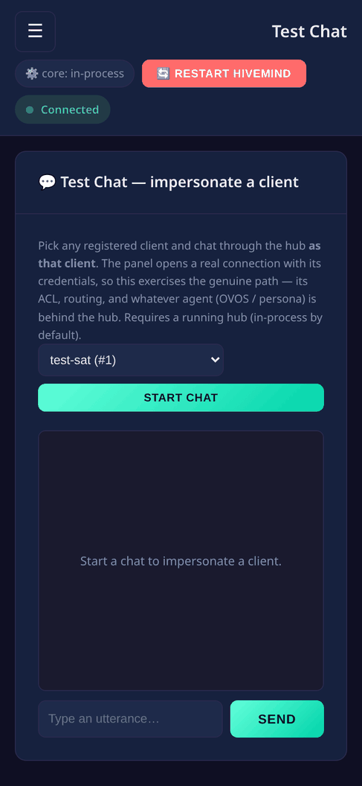

# Test Chat: impersonate a client

The **Test Chat** page is an in-browser chat that talks to your hub *as any
registered client*. Pick a client, type an utterance, and the panel opens a real
connection with that client's credentials, sends the utterance through the hub,
and shows the agent's spoken reply. You are testing the genuine path, not a
simulation.


## Why impersonate?

A HiveMind client (a voice satellite, a CLI, a [bridge](bridges.md)) only sees what
its **ACL** allows, and its messages route through the hub to whatever **agent**
(OVOS skills or a [persona](configuration.md)) sits behind it. Test Chat lets you,
as admin, *be* that client for a moment and verify the whole chain end-to-end:

- the client's credentials still work (handshake succeeds)
- its ACL actually permits `recognizer_loop:utterance`
- the hub routes to an agent and a reply comes back

It is the fastest way to answer "is this client wired up correctly, and does the
hub actually answer it?" without flashing a device or running a bridge.

## How it works

The chat is **server-side impersonation**: the panel (not your browser) runs a
real `HiveMessageBusClient` with the chosen client's key/password/crypto-key and
connects to the hub like a satellite would. Your browser just drives it.

```
browser  →  admin panel (as client X)  →  hub  →  agent (OVOS / persona)  →  reply  →  browser
```

Because it uses the client's real identity, **the client's ACL applies**. If the
client is not allowed to send utterances, the hub drops them. Grant
`recognizer_loop:utterance` on the [Permissions](operations.md) page first (the
[bridge](bridges.md) preset does this for you).

## Use it

1. Open **Test Chat**.
2. Choose a client and click **Start chat**. The status shows
   `impersonating <name> → <hub endpoint>`.
3. Type an utterance and **Send**. Your line shows as *you (as client)*. Replies
   come back labelled *hub*.
4. **End** disconnects the impersonated client.

If you see *"the hub reported no skill/agent handled that utterance"*, the message
reached the hub but nothing answered. Pair the hub with a [persona](configuration.md)
or an [OVOS server](ovos-servers.md), or run your OVOS skills.

## Requirements & limits

- Needs a **reachable hub**, the in-process one by default. In `--no-core` mode
  there is no hub to talk to.
- Needs an **agent backend** for replies (see [Troubleshooting](troubleshooting.md)
  if the hub is up but never `READY`).
- Admin role only. Sessions are bounded and idle-reaped, one live session per client.

## API

| Method | Path | Description |
|--------|------|-------------|
| POST   | `/chat/sessions` | Start impersonating `{client_id}` → `{session_id, name, endpoint}` |
| POST   | `/chat/sessions/{sid}/say` | Send `{utterance, lang?}` as the client |
| GET    | `/chat/sessions/{sid}/messages?since=N` | Poll the transcript |
| DELETE | `/chat/sessions/{sid}` | End the session |

See the [API reference](api-reference.md) for details.


### What it looks like

**Widescreen**



**Mobile**



---
[← Chat bridges](bridges.md) · [Home](index.md) · [Architecture →](architecture.md)
