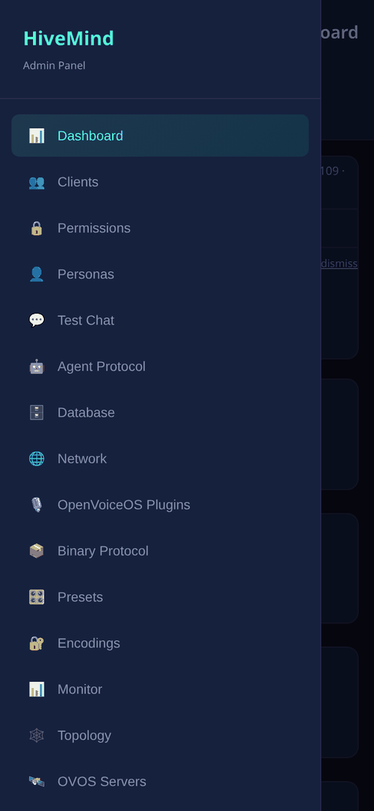
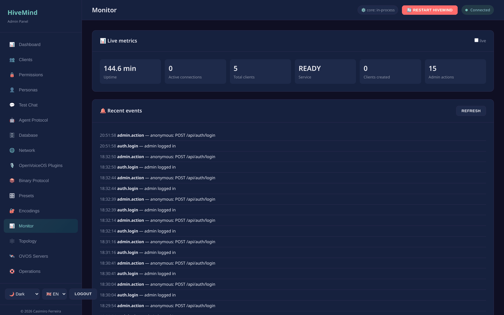
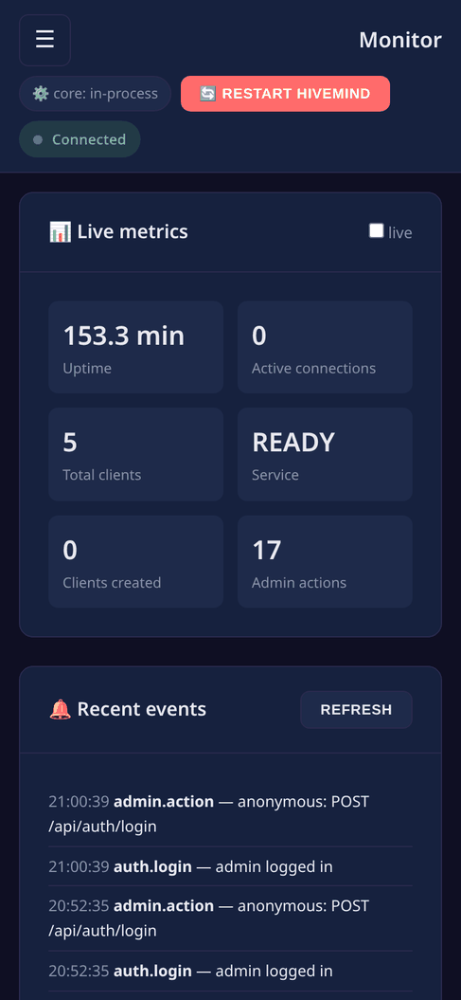

# Troubleshooting & FAQ

> **Paths in this file** omit the `/api` prefix the panel mounts the API under.
> A route written `/clients` is served at `http://<host>:8100/api/clients`.

Practical fixes for the most common issues, then answers to recurring questions.
See also [Running the panel](running.md), [Configuration](configuration.md), and
[Security](security.md).

## Troubleshooting

Each entry is **symptom → cause → fix**.

### Can't log in / 401 Unauthorized

- **Cause:** The panel uses HTTP Basic auth checked against `server.json`, not a
  separate account store. The defaults are `admin` / `admin`, and they may have
  been changed (or never set).
- **Fix:** Credentials live in `~/.config/hivemind-core/server.json` under
  `admin_user` / `admin_pass` (XDG, honoring `XDG_CONFIG_HOME`):

  ```jsonc
  {
    "admin_user": "admin",
    "admin_pass": "admin"
  }
  ```

  Edit them and retry. No restart is needed, since the panel re-reads `server.json` per
  request. `GET /api/setup/status` reports `default_credentials: true` while the
  built-in `admin`/`admin` pair is still in use, a good first thing to check.
  Extra accounts may live in a `users` list. See [Configuration](configuration.md).

### "Admin UI static assets not found" (404 on `/`)

- **Cause:** The package was installed without its bundled `static/` SPA (a
  partial or source-only install).
- **Fix:** Reinstall the package:

  ```bash
  pip install hivemind-admin-panel   # or: uv pip install hivemind-admin-panel
  ```

  The same message is returned for `/index.html`. The API under `/api/*` keeps
  working even when static assets are missing.

### Panel loads but the Monitor shows no live connections

- **Cause:** Live connection and topology data is only authoritative when hivemind-core runs
  **in-process** (the default). With `--no-core` (or `--reload`, which implies it),
  there is no live socket list and `GET /api/connections` returns placeholder data.
  Even with the in-process hivemind-core, the count is real-time. If no satellites are
  actually connected, it correctly shows zero.
- **Fix:** Run the default launcher (`hivemind-admin-panel`, no `--no-core`), then
  confirm a satellite is genuinely connected. If the panel is intentionally in
  `--no-core` mode, the placeholder dash is expected. DB-derived counts in `/api/stats` still
  work.

### hivemind-core won't start but the panel is up (diagnostics mode)

- **Cause:** Constructing the in-process `HiveMindService` failed, so the launcher
  fell back to **diagnostics mode**: the panel stays up so you can read the error
  rather than crashing silently.
- **Fix:** Read the captured error at `GET /api/startup-error` (requires auth). It
  returns the exception type, message, and full traceback. `GET /api/health` will
  report `status: "degraded"`. Restart with more detail using
  `--log-level DEBUG`. Common root causes:
  - the OVOS message bus is not reachable (the agent protocol cannot connect)
  - a bad or missing plugin in `server.json` (agent, network, or database module that
    will not load). Validate config with `POST /api/config/validate`.

### Dashboard says "Satellites can't connect yet"


- **Cause:** The in-process hub started but never reached `READY`. Its satellite
  listener has not bound. Almost always it is blocked waiting on its **agent backend**
  (an OVOS messagebus, default `127.0.0.1:8181`). `GET /api/health` shows
  `service_status: "STARTED"` with `core_ready: false`, and port `5678` is closed.
- **Fix:** Start the agent backend (for example `ovos-messagebus`, or your OVOS instance),
  or point the agent protocol at a reachable bus in `server.json`. The banner clears
  on its own once the hub binds. Until then, clients you create cannot connect, and
  [Test Chat](test-chat.md) has no hub to reach.

### Satellite can't connect to hivemind-core

- **Cause / Fix** (work through these):
  - **Wrong advertised host or port in the pairing bundle.** The hivemind-core's websocket
    transport usually binds `0.0.0.0`, which a satellite cannot dial directly. When
    generating a pairing bundle, pass hivemind-core's LAN IP:
    `GET /api/clients/{id}/pairing?host=<LAN-IP>`. If you omit it while bound to
    `0.0.0.0`, the bundle includes a `note` telling you to supply `?host=`.
  - **Firewall on the websocket port** (default `5678`, set under
    `network_protocol` in `server.json`, *not* the panel's `--port`). Open it on
    the hivemind-core host.
  - **Wrong access key** (or a revoked client). Re-issue credentials from the
    panel and re-pair. hivemind-core logs rejected keys as `auth.rejected` events.

### `--reload` doesn't start hivemind-core

- **Cause:** This is not a bug. `--reload` runs uvicorn in a child process that would not
  carry the in-process hivemind-core thread, so **`--reload` implies `--no-core`** by design.
- **Fix:** Use `--reload` only for UI/dev work. To get a live hivemind-core, drop `--reload`
  and run the plain launcher.

### Live SSE metrics don't update in the browser

- **Cause:** The `/api/events` Server-Sent Events feed is authenticated, but the
  browser `EventSource` API cannot set an `Authorization` header. It must pass a
  token through `?access_token=<token>`. If that token is missing or expired, the
  stream returns a 401 and the dashboard stops updating.
- **Fix:** The UI mints a bearer token (through `POST /api/auth/login`) and appends it
  automatically. If the feed is stale, you are almost certainly looking at an auth
  problem. Log out and back in to refresh the token, and verify your credentials
  work on a normal endpoint.

### Plugin install fails

- **Cause / Fix:**
  - **Not admin.** `POST /api/plugins/install` requires the `admin` role
    (operators get 403). Log in as an admin account.
  - **Bad package name.** Installation shells out to `uv pip install` (falling back
    to `pip` when `uv` is absent). The package must exist on PyPI and resolve. The
    error message returns pip or uv's stderr, so read it.
  - **Timeout.** Installs are capped at 120s. Very large dependency trees can hit
    it.
  - **No effect until restart.** A newly installed package is *not* importable in
    the live interpreter. Restart the service (`POST /api/config/restart` with the
    in-process hivemind-core, or restart the process) before enabling the plugin.

### Port already in use

- **Cause:** Either the **panel** port (default `8100`) or the **hivemind-core transport**
  port (default `5678`) is taken.
- **Fix:** For the panel, pass `--port <n>` (and/or `--host`). For the hivemind-core
  websocket, change the port under `network_protocol` in `server.json`. These are
  independent. Changing one does not change the other.

### License check / CI red on a fork

- **Cause:** The panel requires the **Apache-licensed** core stack at prerelease
  floors. Older `hivemind-core` (4.0.0) still declared AGPL-3.0 and shipped the old
  stack, and `ovos-plugin-manager < 2.6` lacks `find_chat_plugins`.
- **Fix:** Pin the floors (already in `requirements.txt`):

  ```
  hivemind-core>=4.6.1a1,<5.0.0
  ovos-plugin-manager>=2.6.1a2,<3.0.0
  ```

  These are prerelease floors. Make sure your installer allows prereleases for
  those packages.

### A satellite that was reinstalled can never reconnect

**Symptom.** A satellite that used to work is refused on every attempt after a
reinstall, a reflash, or a move to new hardware. The node logs:

```
protocol v3 handshake with sat::... FAILED: client Noise static key
contradicts the pinned key
```

**Cause.** The node pins each client's Noise static key the first time it sees
it (CRYPTO-1 §3.4.5) and refuses any later key for that client. That is what
stops an impostor taking over a known identity — and a genuine reinstall looks
exactly the same from the outside, because the key really did change.

**Fix.** Clear the pin for that one client and let it pair again:

```bash
hivemind-core reset-noise-pin <access-key-or-node-id>
```

Only do this when you know the client actually changed. If you did not
reinstall anything, the refusal may be doing its job.

The client keeps its own pin of the *node's* key, and older clients could get
stuck in the mirror image of this — retrying `KKpsk0` forever. Upgrade
`hivemind-bus-client` to 1.0.8a1 or newer, where the client drops a stale pin
and retries.

### "Address already in use" on port 5678

**Symptom.** hivemind-core restarts in a loop; the log ends with
`OSError: [Errno 98] Address already in use`, and `systemctl --user status`
shows it as `activating` forever.

**Cause.** Two things want the hub port. The usual pair is this panel running
in its default in-process mode — where it *is* the hub — alongside a separate
`hivemind-core` service. Only one can bind 5678.

**Fix.** Decide which one owns the hub and stop the other:

```bash
ss -ltnp | grep 5678        # who has it
systemctl --user disable --now hivemind-core.service   # if the panel owns it
```

Or keep the separate service and run the panel with `--no-core`. Whichever you
pick, the run-mode badge in the top right tells you what the panel thinks it
is doing.

### The hub is running an old version and upgrading does not change it

**Symptom.** You upgrade `hivemind-core`, restart, and the dashboard still
reports the old version. Features that shipped months ago are missing.

**Cause.** In in-process mode the hub runs from the panel's virtualenv, not
whichever one you upgraded, and the panel's own dependency pins constrain it.
A stale upper bound on `hivemind-bus-client` held panels before 0.1.10a1 to
`hivemind-core` 4.11.x no matter what was installed.

**Fix.** Upgrade the panel itself, in the environment the service actually
runs, and confirm what it resolved to:

```bash
VIRTUAL_ENV=/path/to/panel/venv uv pip install -U --prerelease=allow hivemind-admin-panel
/path/to/panel/venv/bin/python -c "import importlib.metadata as m; print(m.version('hivemind-core'))"
```

The version on the dashboard is the one that counts.

### hivemind-core crash-loops after an upgrade with a plugin error

**Symptom.** After upgrading, the service will not start. The log names a
plugin:

```
KeyError: "'hivemind-audio-binary-protocol-plugin' not found. Available plugins: []"
RuntimeError: unknown plugin: ovos-tts-plugin-server
TypeError: 'NoneType' object is not callable      # an STT or VAD plugin
KeyError: 'vad'
```

**Cause.** Optional plugins live in the same environment and are not
dependencies of the thing you upgraded, so a resolve can leave them behind.
The binary (audio) protocol needs an STT, a TTS and a VAD plugin, and it wants
them named in its own config block — a missing key raises rather than falling
back.

**Fix.** Reinstall the plugins the config asks for, then give the binary
protocol explicit settings:

```json
"binary_protocol": {
  "module": "hivemind-audio-binary-protocol-plugin",
  "hivemind-audio-binary-protocol-plugin": {
    "stt": {"module": "ovos-stt-plugin-server"},
    "tts": {"module": "ovos-tts-plugin-server"},
    "vad": {"module": "ovos-vad-plugin-silero"}
  }
}
```

To get the hub back up immediately while you sort the audio stack out, set
`"binary_protocol": {"module": null}`. Audio streaming stops; everything else
keeps working.

### The panel is unusable on a phone

**Symptom.** You sign in on a phone, land on the dashboard, and cannot reach
any other page. Tables slide off the side of the screen.

**Cause.** Panels up to and including 0.1.10a1 had the mobile stylesheet but no
control to open the navigation drawer, so every page except the dashboard was
unreachable, and wide tables stretched the page instead of scrolling.

**Fix.** Upgrade to the release after 0.1.10a1. There is now a ☰ button in the
top left on narrow screens; it opens a scrolling drawer, which closes again
when you pick a page.



## FAQ

### Do I need to run `hivemind-core` separately?

No. `hivemind-admin-panel` is the single launcher. By default it constructs and
runs hivemind-core **in-process** and serves the UI from one command. There is no
separate `hivemind-core` process to start. Use `--no-core` only if you want the
panel to manage on-disk state without a running hivemind-core. See [Running](running.md).

### Is it safe to expose on the internet?

No, not directly. The admin plane can install Python packages, migrate or clear
databases, mint client credentials, and restart the service. Treat it like shell
access. Bind `127.0.0.1` (the default), or front it with a TLS-terminating,
authenticating reverse proxy if it must be reachable. The panel speaks plain HTTP
and has no CSRF protection. Full guidance is in [Security](security.md).

### How do I change the admin password?

Two ways:

- **From the panel:** `POST /api/auth/password` with `old_password` /
  `new_password`. The new value is stored as a PBKDF2-SHA256 hash
  (`pbkdf2_sha256$...`).
- **By editing `server.json`:** set `admin_pass`. Both plaintext and PBKDF2 hashes
  are accepted, so you can paste a hash if you don't want a cleartext password on
  disk.

### How do I add a read-only operator?

Add an entry to the `users` list in `server.json` with `role: "operator"`:

```jsonc
{
  "users": [
    { "username": "ops", "password": "pbkdf2_sha256$...", "role": "operator" }
  ]
}
```

Operators get read access plus non-destructive writes but are barred from
admin-only actions (plugin install, database migrate/clear, restore, policy and
certificate changes). The primary `admin_user` is always full admin.

### Where is my data?

- **`~/.config/hivemind-core/server.json`**: all configuration and credentials.
- **The client database**: under your XDG data dir (or wherever the configured
  database backend stores it). Database *profiles* live in
  `~/.config/hivemind-core/database_profiles/*.json`.
- **Personas**: `~/.config/ovos_persona/*.json`.

Back up a portable bundle (config + clients with secrets + registered servers) via
`GET /api/backup`, and restore it with `POST /api/restore`. See
[Configuration](configuration.md).

### Does it work without a GPU?

Yes. A persona is just an ordered list of `handlers`. You can build one entirely
from factual or tool engines (Wolfram Alpha, Wikipedia, DuckDuckGo) or scripted ones
(RiveScript), none of which need a GPU. LLM handlers (OpenAI, Claude, Gemini, or local
GGUF) are optional and can be mixed in. See [Configuration](configuration.md).

### Can the panel manage more than one hivemind-core?

No, one panel instance manages exactly one hivemind-core (the one it launches,
or the on-disk state it reads in `--no-core` mode). Run a separate panel per
hivemind-core instance.


### What it looks like

**Widescreen**



**Mobile**



---
[← Glossary](glossary.md) · [Home](index.md) · [Running →](running.md)
