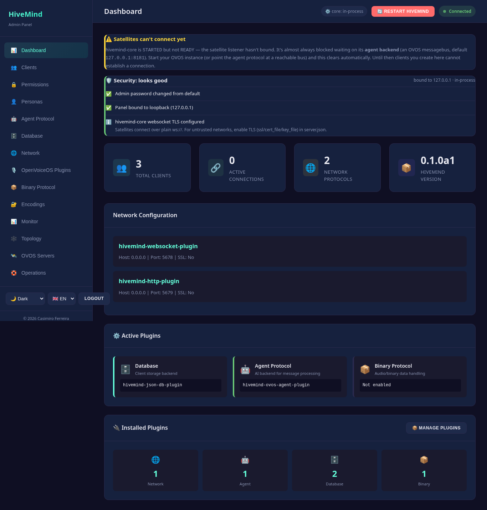

# Troubleshooting & FAQ

Practical fixes for the most common issues, then answers to recurring questions.
See also [Running the panel](running.md), [Configuration](configuration.md), and
[Security](security.md).

## Troubleshooting

Each entry is **symptom → cause → fix**.

### Can't log in / 401 Unauthorized

- **Cause:** The panel uses HTTP Basic auth checked against `server.json`, not a
  separate account store. The defaults are `admin` / `admin`, and they may have
  been changed (or never set).
- **Fix:** Credentials live in `~/.config/hivemind-core/server.json` under
  `admin_user` / `admin_pass` (XDG; honours `XDG_CONFIG_HOME`):

  ```jsonc
  {
    "admin_user": "admin",
    "admin_pass": "admin"
  }
  ```

  Edit them and retry (no restart needed — the panel re-reads `server.json` per
  request). `GET /api/setup/status` reports `default_credentials: true` while the
  built-in `admin`/`admin` pair is still in use — a good first thing to check.
  Extra accounts may live in a `users` list; see [Configuration](configuration.md).

### "Admin UI static assets not found" (404 on `/`)

- **Cause:** The package was installed without its bundled `static/` SPA (a
  partial or source-only install).
- **Fix:** Reinstall the package:

  ```bash
  pip install hivemind-admin-panel   # or: uv pip install hivemind-admin-panel
  ```

  The same message is returned for `/index.html`. The API under `/api/*` keeps
  working even when static assets are missing.

### Panel loads but the Monitor shows no live connections / "—"

- **Cause:** Live connection/topology data is only authoritative when hivemind-core runs
  **in-process** (the default). With `--no-core` (or `--reload`, which implies it),
  there is no live socket list and `GET /api/connections` returns placeholder data.
  Even with the in-process hivemind-core, the count is real-time — if no satellites are
  actually connected it correctly shows zero.
- **Fix:** Run the default launcher (`hivemind-admin-panel`, no `--no-core`), then
  confirm a satellite is genuinely connected. If the panel is intentionally in
  `--no-core` mode, the "—" is expected; DB-derived counts in `/api/stats` still
  work.

### hivemind-core won't start but the panel is up (diagnostics mode)

- **Cause:** Constructing the in-process `HiveMindService` failed, so the launcher
  fell back to **diagnostics mode**: the panel stays up so you can read the error
  rather than crashing silently.
- **Fix:** Read the captured error at `GET /api/startup-error` (requires auth) — it
  returns the exception type, message, and full traceback. `GET /api/health` will
  report `status: "degraded"`. Restart with more detail via
  `--log-level DEBUG`. Common root causes:
  - the OVOS message bus isn't reachable (the agent protocol can't connect);
  - a bad or missing plugin in `server.json` (agent/network/database module that
    won't load). Validate config with `POST /api/config/validate`.

### Dashboard says "Satellites can't connect yet"



- **Cause:** The in-process hub started but never reached `READY` — its satellite
  listener hasn't bound. Almost always it's blocked waiting on its **agent backend**
  (an OVOS messagebus, default `127.0.0.1:8181`). `GET /api/health` shows
  `service_status: "STARTED"` with `core_ready: false`, and port `5678` is closed.
- **Fix:** Start the agent backend (e.g. `ovos-messagebus`, or your OVOS instance),
  or point the agent protocol at a reachable bus in `server.json`. The banner clears
  on its own once the hub binds. Until then, clients you create can't connect and
  [Test Chat](test-chat.md) has no hub to reach.

### Satellite can't connect to hivemind-core

- **Cause / Fix** (work through these):
  - **Wrong advertised host/port in the pairing bundle.** The hivemind-core's websocket
    transport usually binds `0.0.0.0`, which a satellite cannot dial directly. When
    generating a pairing bundle, pass hivemind-core's LAN IP:
    `GET /api/clients/{id}/pairing?host=<LAN-IP>`. If you omit it while bound to
    `0.0.0.0`, the bundle includes a `note` telling you to supply `?host=`.
  - **Firewall on the websocket port** (default `5678`, set under
    `network_protocol` in `server.json`, *not* the panel's `--port`). Open it on
    hivemind-core host.
  - **Wrong access key** (or a revoked client). Re-issue credentials from the
    panel and re-pair. hivemind-core logs rejected keys as `auth.rejected` events.

### `--reload` doesn't start hivemind-core

- **Cause:** Not a bug. `--reload` runs uvicorn in a child process that would not
  carry the in-process hivemind-core thread, so **`--reload` implies `--no-core`** by design.
- **Fix:** Use `--reload` only for UI/dev work. To get a live hivemind-core, drop `--reload`
  and run the plain launcher.

### Live SSE metrics don't update in the browser

- **Cause:** The `/api/events` Server-Sent Events feed is authenticated, but the
  browser `EventSource` API can't set an `Authorization` header — it must pass a
  token via `?access_token=<token>`. If that token is missing or expired, the
  stream 401s and the dashboard stops updating.
- **Fix:** The UI mints a bearer token (via `POST /api/auth/login`) and appends it
  automatically; if the feed is stale, you're almost certainly looking at an auth
  problem — log out and back in to refresh the token, and verify your credentials
  work on a normal endpoint.

### Plugin install fails

- **Cause / Fix:**
  - **Not admin.** `POST /api/plugins/install` requires the `admin` role
    (operators get 403). Log in as an admin account.
  - **Bad package name.** Installation shells out to `uv pip install` (falling back
    to `pip` when `uv` is absent); the package must exist on PyPI and resolve. The
    error message returns pip/uv's stderr — read it.
  - **Timeout.** Installs are capped at 120s; very large dependency trees can hit
    it.
  - **No effect until restart.** A newly installed package is *not* importable in
    the live interpreter. Restart the service (`POST /api/config/restart` with the
    in-process hivemind-core, or restart the process) before enabling the plugin.

### Port already in use

- **Cause:** Either the **panel** port (default `8100`) or the **hivemind-core transport**
  port (default `5678`) is taken.
- **Fix:** For the panel, pass `--port <n>` (and/or `--host`). For hivemind-core
  websocket, change the port under `network_protocol` in `server.json`. These are
  independent — changing one does not change the other.

### License check / CI red on a fork

- **Cause:** The panel requires the **Apache-licensed** core stack at prerelease
  floors. Older `hivemind-core` (4.0.0) still declared AGPL-3.0 and shipped the old
  stack, and `ovos-plugin-manager < 2.6` lacks `find_chat_plugins`.
- **Fix:** Pin the floors (already in `requirements.txt`):

  ```
  hivemind-core>=4.6.1a1,<5.0.0
  ovos-plugin-manager>=2.6.1a2,<3.0.0
  ```

  These are prerelease floors — make sure your installer allows prereleases for
  those packages.

## FAQ

### Do I need to run `hivemind-core` separately?

No. `hivemind-admin-panel` is the single launcher — by default it constructs and
runs hivemind-core **in-process** and serves the UI from one command. There is no
separate `hivemind-core` process to start. Use `--no-core` only if you want the
panel to manage on-disk state without a running hivemind-core. See [Running](running.md).

### Is it safe to expose on the internet?

No — not directly. The admin plane can install Python packages, migrate/clear
databases, mint client credentials, and restart the service; treat it like shell
access. Bind `127.0.0.1` (the default), or front it with a TLS-terminating,
authenticating reverse proxy if it must be reachable. The panel speaks plain HTTP
and has no CSRF protection. Full guidance in [Security](security.md).

### How do I change the admin password?

Two ways:

- **From the panel:** `POST /api/auth/password` with `old_password` /
  `new_password`. The new value is stored as a PBKDF2-SHA256 hash
  (`pbkdf2_sha256$...`).
- **By editing `server.json`:** set `admin_pass`. Both plaintext and PBKDF2 hashes
  are accepted, so you can paste a hash if you don't want a cleartext password on
  disk.

### How do I add a read-only operator?

Add an entry to the `users` list in `server.json` with `role: "operator"`:

```jsonc
{
  "users": [
    { "username": "ops", "password": "pbkdf2_sha256$...", "role": "operator" }
  ]
}
```

Operators get read access plus non-destructive writes but are barred from
admin-only actions (plugin install, database migrate/clear, restore, policy and
certificate changes). The primary `admin_user` is always full admin.

### Where is my data?

- **`~/.config/hivemind-core/server.json`** — all configuration and credentials.
- **The client database** — under your XDG data dir (or wherever the configured
  database backend stores it); database *profiles* live in
  `~/.config/hivemind-core/database_profiles/*.json`.
- **Personas** — `~/.config/ovos_persona/*.json`.

Back up a portable bundle (config + clients with secrets + registered servers) via
`GET /api/backup`, and restore it with `POST /api/restore`. See
[Configuration](configuration.md).

### Does it work without a GPU?

Yes. A persona is just an ordered list of `handlers`. You can build one entirely
from factual/tool engines (Wolfram Alpha, Wikipedia, DuckDuckGo) or scripted ones
(RiveScript) — none of which need a GPU. LLM handlers (OpenAI/Claude/Gemini/local
GGUF) are optional and can be mixed in. See [Configuration](configuration.md).

### Can the panel manage more than one hivemind-core?

No — one panel instance manages exactly one hivemind-core (the one it launches,
or the on-disk state it reads in `--no-core` mode). Run a separate panel per
hivemind-core instance.

---

<!-- nav-footer -->
|  |  |  |
|:--|:-:|--:|
| ← [Glossary](glossary.md) | [📖 Docs home](index.md) | [Running](running.md) → |
