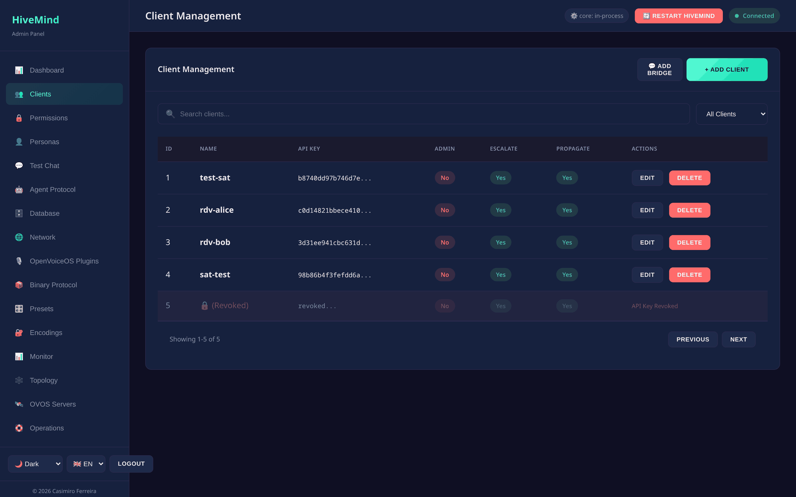
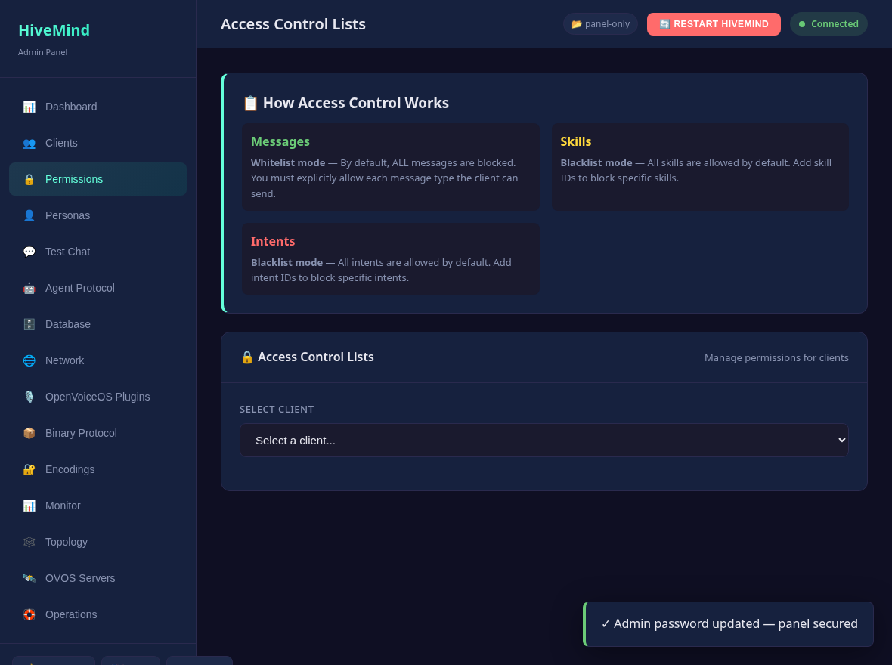
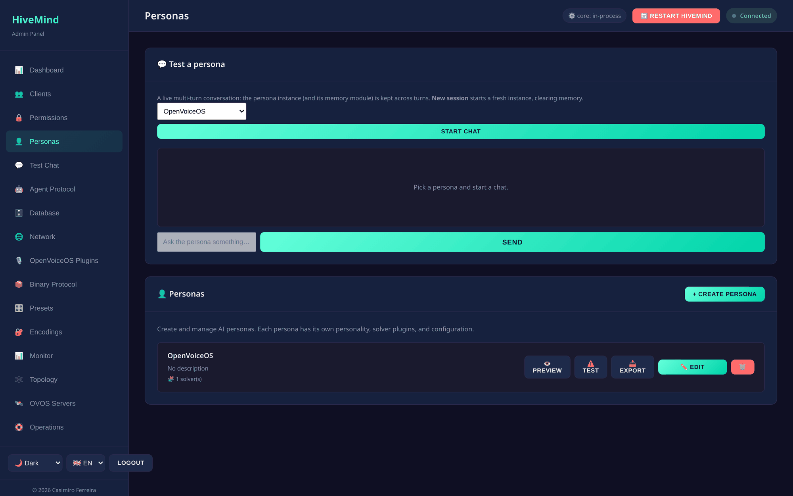
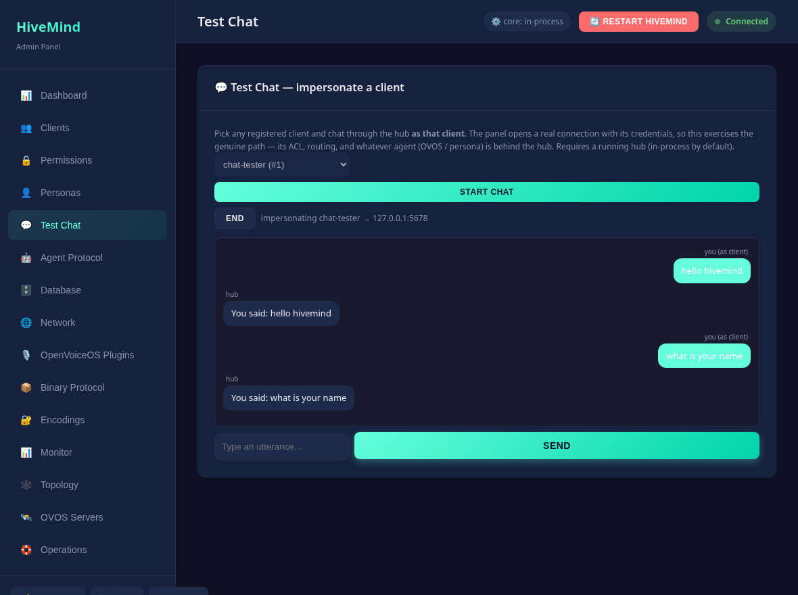

# Tutorial: zero to hero

A complete, hands-on walkthrough. By the end you will have launched hivemind-core,
secured it, paired a satellite, given it a personality, and watched it live. It
takes about 15 minutes and needs only Python 3.10+.

If a term is new, check [Concepts](concepts.md) or the [Glossary](glossary.md).

## 1. Install

```bash
pip install hivemind-admin-panel
```

This pulls in `hivemind-core` automatically.

## 2. Launch

```bash
hivemind-admin-panel --host 127.0.0.1 --port 8100
```

That single command starts hivemind-core **in-process** and serves the web UI.
Open <http://127.0.0.1:8100> and log in. The default credentials are
`admin` / `admin`.

> Seeing a warning banner about default credentials? Good, that is the panel
> nudging you to step 3.

## 3. Lock down the admin login

Default credentials are dangerous, so the panel **forces the issue**. On first
login with the default password, a modal blocks the whole UI until you set a new
one (minimum 8 characters, stored hashed). Type a strong password and continue.
The dashboard's **Security** card then turns green.


You can change it again any time:

- In the UI: the Security card's **Change admin password** button, or
- through the API:

```bash
curl -u admin:admin -X POST http://127.0.0.1:8100/api/auth/password \
  -H 'Content-Type: application/json' \
  -d '{"old_password": "admin", "new_password": "a-strong-password"}'
```

The new password is stored **hashed** (PBKDF2). From now on, log in with it.
For a read-only colleague, add an **operator** account in `server.json` (see
[Security](security.md)).

## 4. Create your first satellite (client)



Go to **Clients → + Add**, give it a name like `kitchen-speaker`. The panel mints
an **access key** and secrets for you. (Through the API:)

```bash
curl -u admin:a-strong-password -X POST http://127.0.0.1:8100/api/clients \
  -H 'Content-Type: application/json' -d '{"name": "kitchen-speaker"}'
```

## 5. Pair it with a QR code

Open the **Topology** page. You see hivemind-core in the center and your new
satellite around it. **Click the satellite** to open a pairing dialog with a **QR
code** plus the full connection bundle (key, host, port).

- If hivemind-core is bound to `0.0.0.0`, enter your machine's **LAN IP** when
  prompted, so the satellite knows where to connect.
- Scan the QR (or copy the bundle) into your HiveMind satellite device
  (`hivemind-voice-sat`, `hivemind-mic-satellite`, or `hivemind-cli`).

The satellite connects over the encrypted websocket transport (port 5678).

## 6. Give it permissions (ACL)



A fresh client cannot do anything until you allow message types. Go to
**Permissions**, pick `kitchen-speaker`, and **allow** `recognizer_loop:utterance`
so it can send spoken requests. (Through the API:)

```bash
curl -u admin:a-strong-password -X POST \
  http://127.0.0.1:8100/api/clients/1/allow-msg \
  -H 'Content-Type: application/json' \
  -d '{"msg_type": "recognizer_loop:utterance"}'
```

Tip: save this as a **template** and apply it to future satellites in one click.

## 7. Give it a personality (persona)



Go to **Personas → + Create**. A persona is an ordered list of **handlers**. For a
no-GPU start, use a factual or scripted handler. For an LLM, pick an OpenAI-style
handler and paste your API details. Example persona JSON:

```jsonc
{
  "name": "Assistant",
  "handlers": ["ovos-solver-openai-plugin"],
  "ovos-solver-openai-plugin": { "api_url": "https://api.openai.com/v1", "key": "sk-..." },
  "memory_module": "ovos-agents-short-term-memory-plugin"
}
```

Then **test it without any device**: use the **Test a persona** box on the
Personas page (or `POST /api/personas/Assistant/chat`) and chat with it right in
the browser.

## 8. Chat as your satellite

Open **Test Chat**, pick `kitchen-speaker`, and **Start chat**. You are now talking
to the hub *as that client*. Type a message and the agent answers. This proves the
satellite's ACL and the whole hub-to-agent path end-to-end, with no device required.



## 9. Watch it live

Open **Monitor**:

- **Metrics**: uptime, active connections, message counts. Tick **live** to
  stream updates.
- **Message inspector / events**: every message your satellite sends appears
  here in real time (filter by type or peer).
- **Core log & audit log**: the hivemind-core log tail, and a record of every
  admin change (who did what).

Open **Topology** again. Your paired satellite now shows **online**.

## 10. Back it up

Before you forget: **Operations → Download backup** saves a bundle (config +
clients + servers). Restore it any time with **Restore…**.

## Next steps

You have run a secured hivemind-core, onboarded a satellite, given it an ACL and a
persona, and monitored it live. Where to go next:

- **[Operations](operations.md)**: roles, TLS, policy chain, backups in depth.
- **[OVOS servers](ovos-servers.md)**: offload speech or LLM work to networked servers
  for a homelab.
- **[Configuration](configuration.md)**: every `server.json` knob.
- **[Troubleshooting](troubleshooting.md)**: if anything misbehaved.

---
[← Getting started](getting-started.md) · [Home](index.md) · [Glossary →](glossary.md)
